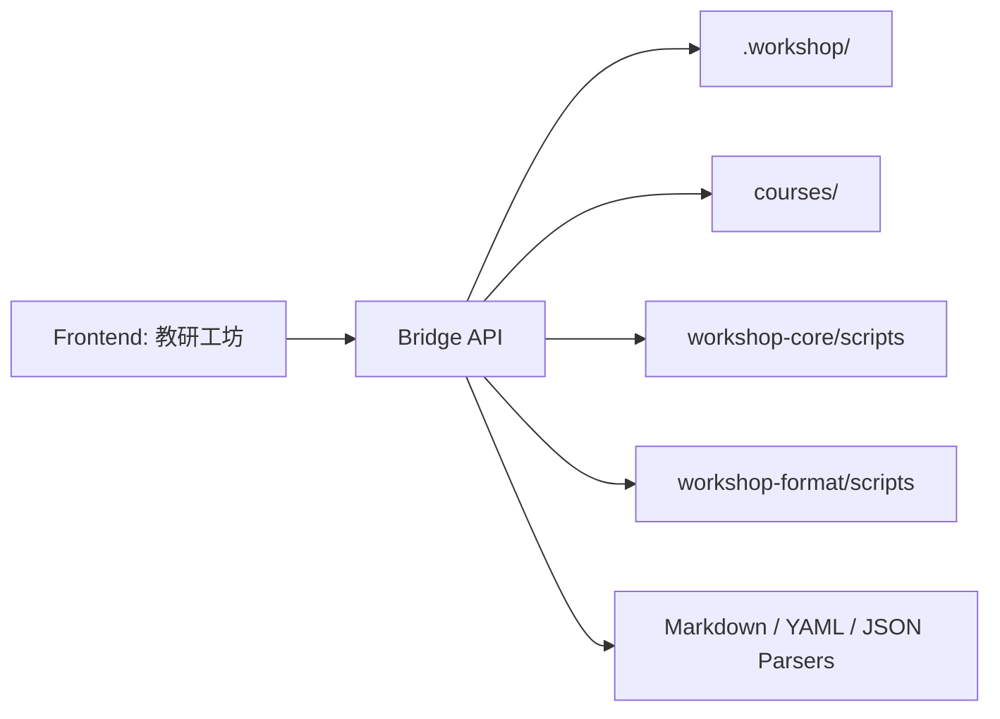

# 教研工坊 Bridge 与技术实现方案

## 1. 文档目的

本文件定义：

- 前端如何连接 `course-workshop` 当前运行时
- bridge 层负责什么
- API 如何组织
- Markdown / artifact 如何解析
- 推荐的实现顺序是什么

目标是把“教研工坊”前端和 `.workshop` 运行时真正接起来。

## 2. 设计目标

bridge 层只做一件事：

**把 `.workshop/` 和现有脚本能力，转换成前端稳定可调用的工作台接口。**

它不是新的业务系统，不重写课程方法论，也不替代现有插件能力。

## 3. 职责边界

### 3.1 bridge 负责

- 读取 `.workshop/`
- 扫描 project / plan / exports
- 解析 `status.json` / `config.yaml`
- 读取 Markdown artifacts
- 调用已有脚本
- 产出结构化 JSON

### 3.2 bridge 不负责

- 重写课程业务逻辑
- 替代 skill 的生成能力
- 维护第二套项目状态
- 真正生成 docx/pdf

## 4. 总体架构



## 5. 推荐实现方式

建议做一个轻量本地服务：

- Node 或 Python 都可以
- 更推荐：
  - 前端：React / Next.js
  - bridge：Node façade
  - 内部调用已有 Python scripts

### 5.1 为什么推荐 Node façade + Python scripts

- 前端接 API 会更自然
- 可以保留现有 Python 脚本，不重复造轮子
- 后续如果接桌面容器或本地服务，也更容易扩

## 6. API 设计原则

### 6.1 面向工作对象，不面向文件

不要暴露：

- “读取某个 md 文件”

优先暴露：

- 获取项目摘要
- 获取主题 framing 数据
- 获取周安排
- 获取活动稿

### 6.2 读写分离

- GET：取状态 / 内容
- POST / PATCH：执行动作或保存变更

### 6.3 保留底层可追溯性

返回结果里保留：

- source path
- last modified
- artifact id

## 7. 核心 API

### 7.1 Health

`GET /api/health`

用途：

- 前端启动时检查 bridge 是否可用

返回示例：

```json
{
  "ok": true,
  "workspaceRoot": "/path/to/repo",
  "runtimeRoot": ".workshop"
}
```

### 7.2 Runtime Summary

`GET /api/runtime/summary`

用途：

- 首页加载全局摘要

返回示例：

```json
{
  "projects": 12,
  "plans": 7,
  "exports": 4,
  "awaitingReview": 3,
  "changesRequested": 2
}
```

建议：

- 直接适配 `workspace_status.py summarize-status`

### 7.3 Projects List

`GET /api/projects`

可选参数：

- `phase`
- `hilStatus`
- `owner`
- `q`

返回示例：

```json
{
  "items": [
    {
      "id": "clothing-and-seasons",
      "theme": "多样的服饰",
      "pipeline": "thematic-curriculum",
      "phase": "reviewing",
      "hil": {
        "checkpoint": "deliverable-draft",
        "status": "awaiting_review"
      },
      "planRefs": {
        "month": "2026-sep",
        "week": "2026-sep-week-2"
      },
      "skillsDone": 9,
      "skillsTotal": 14,
      "updatedAt": "2026-03-31T10:20:00+08:00"
    }
  ]
}
```

### 7.4 Project Detail

`GET /api/projects/:projectId`

用途：

- Project Workspace 总控页

返回示例：

```json
{
  "summary": { "...": "ProjectSummary" },
  "config": {
    "pipeline": "thematic-curriculum",
    "documentType": "theme-package"
  },
  "deliverables": [
    {
      "id": "framing",
      "status": "ready",
      "artifacts": ["theme-analysis", "theme-narrative", "theme-network"],
      "missing": []
    },
    {
      "id": "month",
      "status": "in_progress",
      "artifacts": ["month-plan"],
      "missing": ["week-plan"]
    }
  ],
  "linkedPlans": [
    {
      "id": "2026-sep-week-2",
      "level": "week"
    }
  ],
  "timeline": [],
  "paths": {
    "workspace": ".workshop/projects/clothing-and-seasons"
  }
}
```

### 7.5 Project Framing

`GET /api/projects/:projectId/framing`

用途：

- Theme Framing 页面

返回示例：

```json
{
  "analysis": {
    "exists": true,
    "content": "...markdown...",
    "updatedAt": "..."
  },
  "narrative": {
    "exists": true,
    "content": "...markdown...",
    "updatedAt": "..."
  },
  "network": {
    "exists": true,
    "content": "...markdown...",
    "updatedAt": "..."
  },
  "hil": {
    "checkpoint": "project-framing",
    "status": "awaiting_review"
  }
}
```

### 7.6 Month Matrix

`GET /api/projects/:projectId/month`

用途：

- Month Matrix 页面

返回示例：

```json
{
  "source": {
    "path": ".workshop/projects/clothing-and-seasons/month-plan.md"
  },
  "progression": [
    { "week": 1, "subtheme": "认识服饰" },
    { "week": 2, "subtheme": "不同场景的服饰" }
  ],
  "matrix": [
    {
      "week": 1,
      "subtheme": "认识服饰",
      "teaching": ["这是谁的衣服"],
      "region": ["衣服配对角"],
      "outdoor": ["换装接力跑"],
      "lifeRoutine": ["根据天气穿衣"],
      "homeSchool": ["观察家人服饰"]
    }
  ],
  "coverage": {
    "teaching": 4,
    "region": 6,
    "outdoor": 2,
    "lifeRoutine": 2,
    "homeSchool": 2
  }
}
```

### 7.7 Week Arrangement

`GET /api/projects/:projectId/weeks/:weekId`

用途：

- 周安排页面

返回示例：

```json
{
  "weekId": "2026-sep-week-2",
  "title": "第2周：不同场景的服饰",
  "items": [
    {
      "id": "wk2-item-01",
      "order": 1,
      "activityType": "teaching",
      "title": "这是谁的衣服",
      "slot": "周一上午",
      "status": "ready",
      "artifactId": "teaching-01"
    }
  ],
  "dayView": {
    "mon": ["wk2-item-01", "wk2-item-02"]
  },
  "materials": [],
  "teacherNotes": []
}
```

### 7.8 Activity Detail

`GET /api/projects/:projectId/activities/:activityId`

用途：

- 活动编辑页

返回示例：

```json
{
  "meta": {
    "id": "teaching-01",
    "activityType": "teaching",
    "title": "这是谁的衣服",
    "week": "2026-sep-week-2",
    "subtheme": "不同场景的服饰",
    "status": "reviewing"
  },
  "sections": [
    {
      "id": "core-goals",
      "title": "核心发展目标",
      "format": "markdown",
      "content": "..."
    },
    {
      "id": "process-table",
      "title": "活动过程",
      "format": "table",
      "rows": []
    }
  ],
  "source": {
    "path": ".workshop/projects/clothing-and-seasons/lesson-plan.md"
  }
}
```

### 7.9 Review Summary

`GET /api/projects/:projectId/review`

返回示例：

```json
{
  "qualityReport": { "exists": true, "path": "..." },
  "reviewComments": { "exists": true, "path": "..." },
  "resourcePlan": { "exists": true, "path": "..." },
  "resourceCheck": { "exists": false, "path": null },
  "canEnterApproval": true
}
```

### 7.10 Export Summary

`GET /api/projects/:projectId/export`

返回示例：

```json
{
  "releaseBundle": {
    "exists": true,
    "path": "courses/clothing-and-seasons",
    "files": ["lesson-plan.md", "resource-plan.md"]
  },
  "targets": [
    {
      "target": "word-ready-bundle",
      "exists": true,
      "manifestPath": ".workshop/exports/clothing-and-seasons/word-ready-bundle/manifest.yaml",
      "ready": true
    },
    {
      "target": "pdf-ready-bundle",
      "exists": false,
      "ready": false
    }
  ]
}
```

## 8. 动作型 API

### 8.1 通用动作入口

`POST /api/actions/run`

请求示例：

```json
{
  "action": "pipeline-select",
  "projectId": "clothing-and-seasons",
  "params": {
    "pipeline": "thematic-curriculum"
  }
}
```

返回示例：

```json
{
  "ok": true,
  "message": "pipeline selected",
  "updatedProject": "clothing-and-seasons"
}
```

推荐 action：

- `init-runtime`
- `config-set`
- `pipeline-select`
- `link-plan`
- `request-hil`
- `approve-hil`
- `reject-hil`
- `approve-project`
- `promote-project`
- `format-lesson`
- `export-bundle`

### 8.2 Artifact 局部保存

`PATCH /api/projects/:projectId/artifacts/:artifactId`

请求示例：

```json
{
  "sectionId": "process-table",
  "content": { "...": "..." }
}
```

bridge 负责：

- 读取源 markdown
- 更新对应 section
- 回写文件

### 8.3 HIL

- `POST /api/projects/:projectId/hil/request`
- `POST /api/projects/:projectId/hil/approve`
- `POST /api/projects/:projectId/hil/reject`

这些直接映射到：

- `request-hil`
- `approve-hil`
- `reject-hil`

### 8.4 审批与发布

- `POST /api/projects/:projectId/approve`
- `POST /api/projects/:projectId/promote`

### 8.5 导出

- `POST /api/projects/:projectId/export-bundle`

## 9. bridge 内部模块

建议拆成：

### 9.1 `runtimeFs`

- 负责路径定位与文件读写

### 9.2 `statusService`

- 负责 `status.json`
- 对接 `workspace_status.py`
- 生成 summary / HIL / deliverable 状态

### 9.3 `artifactService`

- 列出 artifact
- 解析 Markdown
- 生成统一 artifact view-model

### 9.4 `planService`

- 处理 planning 资产与 project 关联

### 9.5 `exportService`

- 处理 release bundle 与 export bundle

### 9.6 `copilotContextService`

- 组装当前页面的 Copilot 上下文

## 10. 解析策略

前端不应直接消费原始 Markdown，而应消费解析后的 artifact view-model。

建议按 artifact kind 走不同 parser，例如：

- `theme-narrative`
- `month-plan`
- `week-plan`
- `lesson-plan`

### 10.1 不要做的事

- 把整篇 Markdown 原样扔给前端当唯一数据结构

### 10.2 要做的事

- 保留原文
- 解析为结构化 sections
- 对特殊结构做专门 parser

例如教学活动过程表应进一步解析为行对象，而不是只保留纯文本表格。

## 11. Artifact Kind Registry

建议统一定义：

- `theme-analysis`
- `theme-narrative`
- `theme-network`
- `month-plan`
- `week-plan`
- `lesson-plan`
- `proposal`
- `region-activity`
- `outdoor-game`
- `life-routine`
- `home-school`
- `quality-report`
- `review-comments`
- `resource-plan`
- `resource-check-report`

每种 kind 对应：

- path matcher
- parser
- view type
- editable sections

这层 registry 会显著降低前后端的偶然耦合。

## 12. 推荐开发顺序

### Phase 1

先做只读：

- `GET /api/projects`
- `GET /api/projects/:id`
- `GET /api/projects/:id/framing`
- `GET /api/projects/:id/weeks/:weekId`

### Phase 2

再做状态动作：

- `pipeline-select`
- `link-plan`
- `request-hil`
- `approve-hil`
- `reject-hil`

### Phase 3

再做编辑：

- activity detail
- section 保存
- 局部改写

### Phase 4

最后做导出与 promote：

- export bundle
- approve
- promote

## 13. 当前最值得先补的接口

如果前端要开始做，建议优先补这 5 个：

1. `GET /api/projects`
2. `GET /api/projects/:projectId`
3. `GET /api/projects/:projectId/framing`
4. `GET /api/projects/:projectId/weeks/:weekId`
5. `POST /api/actions/run`

只要这 5 个稳定，前端第一版就能跑起来。

## 14. 结论

Bridge 层的目标不是创造一个新的后端系统，而是作为教研工坊前端和 `.workshop` 运行时之间的稳定适配层。

只要这层边界控制好，前端就能在不破坏当前插件体系的前提下，构建出完整的 CoWork 产品体验。
