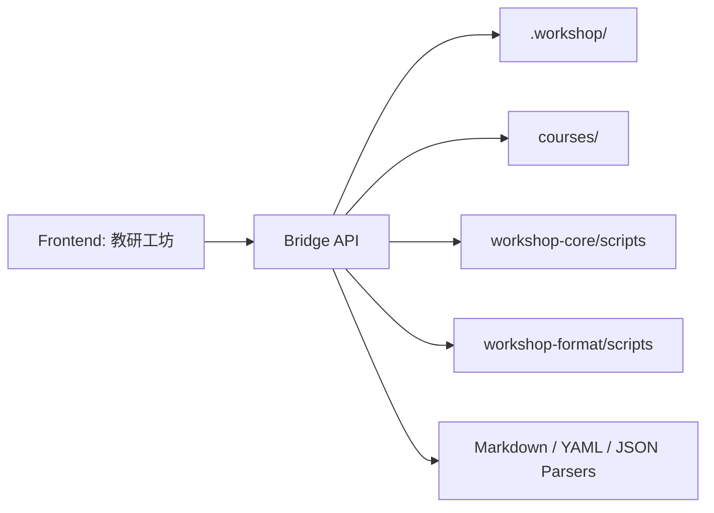

# 教研工坊 Bridge 与技术实现方案

## 1. 文档目的

本文件定义：

- 前端如何连接 `course-workshop` 当前运行时
- bridge 层负责什么
- API 如何组织
- 推荐的实现顺序是什么

## 2. 设计目标

bridge 层只做一件事：

**把 `.workshop/` 和现有脚本能力，转换成前端稳定可调用的工作台接口。**

## 3. 职责边界

### bridge 负责

- 读取 `.workshop/`
- 扫描 project / plan / exports
- 解析 `status.json` / `config.yaml`
- 读取 Markdown artifacts
- 调用已有脚本
- 产出结构化 JSON

### bridge 不负责

- 重写课程业务逻辑
- 替代 skill 的生成能力
- 维护第二套项目状态
- 真正生成 docx/pdf

## 4. 总体架构

## 5. 推荐实现方式

建议做一个轻量本地服务：

- Node 或 Python 都可以
- 更推荐：
  - 前端：React / Next.js
  - bridge：Node façade
  - 内部调用已有 Python scripts

## 6. 核心 API

### 6.1 Health

`GET /api/health`

### 6.2 Runtime Summary

`GET /api/runtime/summary`

### 6.3 Projects List

`GET /api/projects`

### 6.4 Project Detail

`GET /api/projects/:projectId`

### 6.5 Project Framing

`GET /api/projects/:projectId/framing`

### 6.6 Month Matrix

`GET /api/projects/:projectId/month`

### 6.7 Week Arrangement

`GET /api/projects/:projectId/weeks/:weekId`

### 6.8 Activity Detail

`GET /api/projects/:projectId/activities/:activityId`

### 6.9 Review Summary

`GET /api/projects/:projectId/review`

### 6.10 Export Summary

`GET /api/projects/:projectId/export`

## 7. 动作型 API

### 7.1 通用动作入口

`POST /api/actions/run`

推荐 action：

- `init-runtime`
- `config-set`
- `pipeline-select`
- `link-plan`
- `request-hil`
- `approve-hil`
- `reject-hil`
- `approve-project`
- `promote-project`
- `format-lesson`
- `export-bundle`

### 7.2 Artifact 局部保存

`PATCH /api/projects/:projectId/artifacts/:artifactId`

### 7.3 HIL

- `POST /api/projects/:projectId/hil/request`
- `POST /api/projects/:projectId/hil/approve`
- `POST /api/projects/:projectId/hil/reject`

### 7.4 审批与发布

- `POST /api/projects/:projectId/approve`
- `POST /api/projects/:projectId/promote`

### 7.5 导出

- `POST /api/projects/:projectId/export-bundle`

## 8. bridge 内部模块

建议拆成：

### `runtimeFs`

- 负责路径定位与文件读写

### `statusService`

- 负责 `status.json`
- 对接 `workspace_status.py`

### `artifactService`

- 列出 artifact
- 解析 Markdown

### `planService`

- 处理 planning 资产与 project 关联

### `exportService`

- 处理 release bundle 与 export bundle

### `copilotContextService`

- 组装当前页面的 Copilot 上下文

## 9. 解析策略

前端不应直接消费原始 Markdown，而应消费解析后的 artifact view-model。

建议按 artifact kind 走不同 parser，例如：

- `theme-narrative`
- `month-plan`
- `week-plan`
- `lesson-plan`

## 10. Artifact Kind Registry

建议统一定义：

- `theme-analysis`
- `theme-narrative`
- `theme-network`
- `month-plan`
- `week-plan`
- `lesson-plan`
- `proposal`
- `region-activity`
- `outdoor-game`
- `life-routine`
- `home-school`
- `quality-report`
- `review-comments`
- `resource-plan`
- `resource-check-report`

每种 kind 对应：

- path matcher
- parser
- view type
- editable sections

## 11. 开发顺序

### Phase 1

先做只读：

- `GET /api/projects`
- `GET /api/projects/:id`
- `GET /api/projects/:id/framing`
- `GET /api/projects/:id/weeks/:weekId`

### Phase 2

再做状态动作：

- `pipeline-select`
- `link-plan`
- `request-hil`
- `approve-hil`
- `reject-hil`

### Phase 3

再做编辑：

- activity detail
- section 保存
- 局部改写

### Phase 4

最后做导出与 promote：

- export bundle
- approve
- promote

## 12. 当前最值得先补的接口

如果前端要开始做，建议优先补这 5 个：

1. `GET /api/projects`
2. `GET /api/projects/:projectId`
3. `GET /api/projects/:projectId/framing`
4. `GET /api/projects/:projectId/weeks/:weekId`
5. `POST /api/actions/run`

## 13. 结论

Bridge 层的目标不是创造一个新的后端系统，而是作为教研工坊前端和 `.workshop` 运行时之间的稳定适配层。

只要这层边界控制好，前端就能在不破坏当前插件体系的前提下，构建出完整的 CoWork 产品体验。
