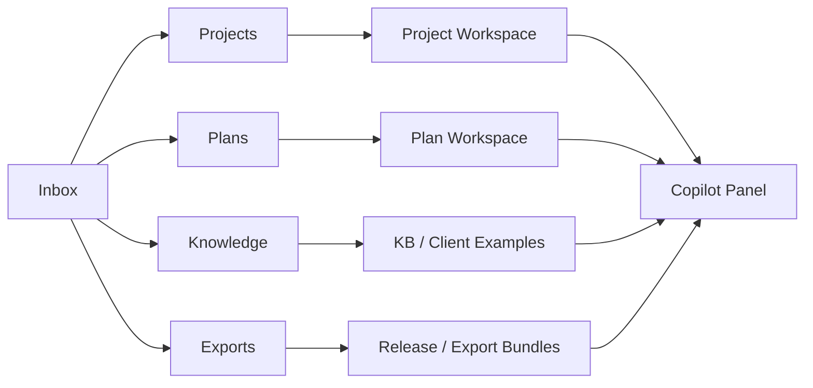

# 教研工坊产品概念方案

## 1. 文档目的

本文件定义“教研工坊”的产品概念层方案，回答四个问题：

1. 这个产品是什么
2. 它服务谁
3. 它为什么要做成 Co-pilot / CoWork 工作台
4. 它与 `course-workshop` 当前运行时能力如何对齐

本文件只讨论产品定位、用户场景和产品主张，不展开页面和技术实现细节。

## 2. 设计来源与约束

本方案参照附件《BeautyAI CoWork-产品介绍202310》的产品思想和产品主张，但不照搬其行业内容。

可迁移的核心思想有五个：

1. 产品不是一个“问答框”，而是一个持续推进工作的工作台
2. AI 的价值不只在生成，而在“生成 + 验证 + 推荐下一步 + 协作沉淀”
3. 用户需要的是从一个念头到一份可落地方案的连续链路
4. 产品应围绕多人共创展开，而不是单人一次性产出
5. 过程资产应被沉淀下来，而不只是得到一个终稿

结合 `course-workshop` 当前的运行时模型，这些思想最适合被落实为一个围绕 **课程项目（project workspace）** 运行的前端产品。

## 3. 产品名称

产品名称：**教研工坊**

## 4. 产品定位

### 4.1 一句话定位

一个围绕课程项目持续推进的 AI 共创工作台，让课研主任、一线教师和交付负责人在同一空间中完成：

- 主题 framing
- 月周编排
- 活动稿生成
- 质量与资源检查
- 审批
- 导出与交付

### 4.2 产品本质

“教研工坊”不是一个“帮你写教案”的 AI 页面，而是一个围绕课程项目运行的工作系统：

- 以 `project` 为主对象
- 以 `plan` 为上游约束
- 以 `pipeline` 为方法论入口
- 以 `HIL` 为关键阶段治理机制
- 以 `release / export bundle` 为交付出口

### 4.3 产品主张

1. **不是生成器，而是工作台**
2. **不是一次产出，而是持续共创**
3. **不是单人使用，而是角色协同**
4. **不是只写内容，而是边生成边验证**
5. **不是只交终稿，而是沉淀全过程资产**

## 5. 为什么这个定位适合 `course-workshop`

`course-workshop` 当前已经具备一套 project-first 运行时基础：

- `.workshop/projects/` 作为 project runtime
- `.workshop/plans/` 作为 planning 资产
- `.workshop/kb/` 作为知识库
- `courses/` 作为 release bundle
- `.workshop/exports/` 作为导出协议层
- `HIL` 作为关键阶段 gate

因此它天然适合被包装成一个“持续推进项目”的前端产品，而不是一个“文档生成器”。

换句话说，底层平台已经不是单轮生成模型，而是一个带状态、带阶段、带审批、带导出的课程工程系统；前端产品就应该把这种“工作台属性”放大，而不是把它扁平化成一堆按钮。

## 6. 目标用户

### 6.1 课研主任

核心任务：

- 接收月度主题
- 判断主题是否成立
- 制定月度与周度结构
- 组织多活动类型产出
- 审核并交付

关注点：

- 主题结构是否成立
- 周次递进是否顺
- 活动分布是否均衡
- 客户模板是否被正确对齐
- 能否减少反复改稿

典型心智：

- “我不是来写一篇文档，我是来带一个课程项目往前走。”

### 6.2 一线教师

核心任务：

- 基于项目补单个活动稿
- 根据班级实际情况微调
- 回复评论和修改意见

关注点：

- 单稿是否够具体
- 是否易于执行
- 是否保留教师观察与支持要点
- 我能不能只改一小段，而不是重写整篇

典型心智：

- “我需要的是一个懂上下文的副驾驶，不是每次从零生成。”

### 6.3 交付负责人 / 客户成功

核心任务：

- 对齐客户模板
- 检查缺项
- 准备导出包
- 推动最终交付

关注点：

- 结构是否稳定
- 客户栏目和编码是否保留
- 导出是否清晰
- 哪些项目已经具备交付条件

典型心智：

- “我更关心交付包是否完整，不想陷在具体内容生产细节里。”

### 6.4 园长 / 审批者

核心任务：

- 在关键 gate 看摘要并作出判断

关注点：

- 是否值得通过
- 风险是什么
- 退回后会回到哪里

典型心智：

- “我不想读 60 页课程稿，我只想在关键节点看到足够清楚的判断依据。”

## 7. 典型场景

### 场景 A：月主题课程包交付

角色：

- 课研主任主导
- 一线教师参与
- 交付负责人收尾

目标：

- 输出完整主题课程包

链路：

- 创建项目
- 选择 pipeline
- 做主题 framing
- 生成月矩阵
- 展开周安排
- 补齐多类型活动稿
- 做质量和资源检查
- 走 HIL
- 导出交付

### 场景 B：教师补单个活动稿

角色：

- 一线教师主导

目标：

- 在既有项目中快速补教学活动、区域活动或家园互动稿

链路：

- 进入已有 project
- 查看周安排缺项
- 打开某个活动稿
- 在结构化编辑器里补写或局部重写
- 提交 review

### 场景 C：客户版导出

角色：

- 交付负责人主导

目标：

- 从结构化课程项目中生成稳定导出包

链路：

- 查看项目已过的 HIL
- 确认 release bundle
- 检查 export bundle target
- 生成导出说明
- 准备 Word/PDF-ready bundle

## 8. 产品总体结构

前端不应按插件组织，而应按工作对象组织。

### 8.1 一级导航

- `Inbox`
- `Projects`
- `Plans`
- `Knowledge`
- `Exports`

### 8.2 核心原则

- 用户先进入项目，不先看到插件列表
- 插件能力以内嵌 action 的形式出现
- Co-pilot 常驻右侧，始终围绕当前工作对象发声
- 页面按“当前任务”组织，不按“系统模块”组织

### 8.3 总体关系

## 9. Co-pilot 的产品角色

Co-pilot 不是聊天框，而是常驻工作副驾驶。

它要持续回答：

1. 你现在正在做什么
2. 下一步最应该做什么
3. 哪些事我可以先替你完成
4. 当前有哪些风险、缺项或待确认点

### 9.1 推荐交互形式

优先使用动作卡片，而不是让用户总是自己输入。

例如：

- 起草主题解读
- 展开第 2 周安排
- 补一个区域活动
- 对齐客户模板
- 发起审批
- 准备导出包

### 9.2 Co-pilot 的输出类型

建议分成四类：

- 推荐动作
- 局部修改建议
- 风险与缺项提醒
- 审批 / 导出摘要

### 9.3 Co-pilot 话术原则

不要：

- “我可以帮助你进行课程设计”

要：

- “第 2 周还缺 2 个活动稿，建议先补区域活动和家园互动。”
- “当前主题解读已经足够进入 project-framing，要不要我先生成审核摘要？”
- “客户模板要求保留‘教师观察与支持要点’，这节教学活动还缺该区块。”

## 10. 产品与底层能力的映射

### 10.1 产品层对象

- 项目
- 规划
- 活动
- 审批
- 导出

### 10.2 底层运行时对象

- `.workshop/projects`
- `.workshop/plans`
- artifacts
- `status.json`
- `hil`
- `courses/`
- `.workshop/exports`

### 10.3 产品层映射原则

- 页面不直接暴露文件系统
- 产品讲“项目、阶段、缺项、建议”
- 底层负责“文件、状态、脚本、目录”

## 11. 成功体验应该是什么

如果“教研工坊”做对了，用户的感受应该是：

- 我不是在拼命找功能，而是在按项目往前走
- 我随时知道下一步做什么
- AI 不只是给我一篇稿，而是在帮我编排、补齐、校验和推动
- 项目过程可追踪，关键决策明确，交付不混乱

## 12. 产品结论

教研工坊最核心的产品判断是：

**它应该是一个围绕课程项目持续推进、持续验证、持续共创的 Co-pilot 工作台。**

这一定义决定了后续页面设计、组件设计、数据模型和技术实现，都必须以：

- project-first
- copilot-first
- HIL-visible
- deliverable-driven

为中心。
