# 教研工坊组件与交互设计

## 1. 文档目的

本文件在《教研工坊-页面级产品方案》的基础上，进一步定义：

- 前端组件树
- 组件职责
- 组件状态
- 关键交互边界

## 2. 组件分层

建议组件分为四层：

1. Shell 层
2. Workspace 层
3. Domain 层
4. Copilot / Governance 层

## 3. 组件树

```mermaid
flowchart TD
    A["AppShell"]
    A --> B["TopNav"]
    A --> C["LeftSidebar"]
    A --> D["MainWorkspace"]
    A --> E["CopilotPanel"]

    D --> F["InboxPage"]
    D --> G["ProjectWorkspacePage"]
    D --> H["ThemeFramingPage"]
    D --> I["MonthMatrixPage"]
    D --> J["WeekArrangementPage"]
    D --> K["ActivityEditorPage"]
    D --> L["ReviewPage"]
    D --> M["ExportPage"]

    G --> N["ProjectHeader"]
    G --> O["PhaseRail"]
    G --> P["DeliverableCards"]
    G --> Q["LinkedPlanPanel"]

    H --> R["ThemeSummaryCard"]
    H --> S["FramingTabs"]
    H --> T["NarrativeEditor"]
    H --> U["NetworkView"]

    I --> V["ProgressionRail"]
    I --> W["MatrixTable"]
    I --> X["CoveragePanel"]

    J --> Y["WeekList"]
    J --> Z["DayView"]
    J --> AA["TeacherMemoPanel"]

    K --> AB["ActivityMetaBar"]
    K --> AC["SectionEditor"]
    K --> AD["VersionTimeline"]

    E --> AE["ContextSummary"]
    E --> AF["SuggestedActions"]
    E --> AG["CopilotChat"]
    E --> AH["WarningsPanel"]
```

## 4. Shell 层

### `AppShell`

职责：

- 管理全局布局
- 承载主画布与右侧 Copilot

### `TopNav`

职责：

- 提供一级导航
- 提供全局搜索
- 显示当前用户

### `LeftSidebar`

职责：

- 展示页面上下文内的二级导航
- 提供对象列表、筛选和 badge

## 5. Workspace 层

### `ProjectHeader`

显示：

- 项目名
- 主题
- pipeline
- phase
- owner
- 更新时间

### `PhaseRail`

职责：

- 可视化 HIL 大阶段

阶段：

- Project Framing
- Design Scaffold
- Deliverable Draft
- Approval Gate

### `DeliverableCards`

职责：

- 展示项目当前六类工作模块的状态

卡片：

- Framing
- Month
- Week
- Activities
- Review
- Export

### `LinkedPlanPanel`

职责：

- 展示项目关联的 semester / month / week

## 6. Domain 层

### `ThemeSummaryCard`

职责：

- 在 Theme Framing 页面提供稳定上下文

### `FramingTabs`

职责：

- 在分析 / 解读 / 网络之间切换

### `NarrativeEditor`

职责：

- 结构化展示并编辑主题解读

### `NetworkView`

职责：

- 用树形和表格双视图展示主题网络

### `ProgressionRail`

职责：

- 展示月度 4 周递进

### `MatrixTable`

职责：

- 承载月度活动矩阵

### `CoveragePanel`

职责：

- 汇总活动类型覆盖与风险

### `WeekList`

职责：

- 按顺序显示一周活动

### `DayView`

职责：

- 按天展示周安排

### `TeacherMemoPanel`

职责：

- 展示教师备忘、材料提醒与重点

### `ActivityMetaBar`

职责：

- 显示活动稿元信息

### `SectionEditor`

职责：

- 以结构化 section 编辑活动稿

### `ProcessTableEditor`

职责：

- 专门处理教学活动中的过程表

### `VersionTimeline`

职责：

- 展示活动稿修改历史

## 7. Copilot / Governance 层

### `CopilotPanel`

职责：

- 承载右侧副驾驶体验

### `ContextSummary`

职责：

- 一句话说明当前页面上下文

### `SuggestedActions`

职责：

- 提供一组当前最适合执行的动作按钮

### `WarningsPanel`

职责：

- 明确显示缺项、风险和冲突

### `CopilotChat`

职责：

- 容纳补充输入和追问

### `HILGateModal`

职责：

- 显式处理 HIL 通过 / 驳回 / 评论

## 8. 统一状态设计

所有主要组件建议共用以下状态语义：

- `empty`
- `draft`
- `in_progress`
- `awaiting_review`
- `approved`

HIL 组件则使用：

- `not_started`
- `awaiting_review`
- `changes_requested`
- `approved`

## 9. 关键交互原则

1. Co-pilot 优先给动作，而不是让用户自己猜命令
2. 活动稿优先局部编辑，而不是整篇重写
3. Gate 必须显式可见
4. Month / Week 页面要优先体现结构，而不是长文本

## 10. 组件设计结论

组件体系的目标不是“组件越多越好”，而是把产品体验稳定在三件事上：

- 当前在做什么
- 下一步做什么
- 谁来确认推进

这正是 CoWork 式产品体验的核心。
