# 教研工坊组件与交互设计

## 1. 文档目的

本文件在《教研工坊-页面级产品方案》的基础上，进一步定义：

- 前端组件树
- 组件职责
- 组件状态
- 关键交互边界

目标是把页面方案进一步拆到可设计、可实现的 UI 组件层级。

## 2. 组件分层

建议组件分为四层：

1. Shell 层
2. Workspace 层
3. Domain 层
4. Copilot / Governance 层

这样拆的原因是：

- Shell 层负责全局一致性
- Workspace 层负责对象级页面骨架
- Domain 层负责业务表达
- Copilot / Governance 层负责协作、建议与 gate

## 3. 组件树

```mermaid
flowchart TD
    A["AppShell"]
    A --> B["TopNav"]
    A --> C["LeftSidebar"]
    A --> D["MainWorkspace"]
    A --> E["CopilotPanel"]

    D --> F["InboxPage"]
    D --> G["ProjectWorkspacePage"]
    D --> H["ThemeFramingPage"]
    D --> I["MonthMatrixPage"]
    D --> J["WeekArrangementPage"]
    D --> K["ActivityEditorPage"]
    D --> L["ReviewPage"]
    D --> M["ExportPage"]

    G --> N["ProjectHeader"]
    G --> O["PhaseRail"]
    G --> P["DeliverableCards"]
    G --> Q["LinkedPlanPanel"]

    H --> R["ThemeSummaryCard"]
    H --> S["FramingTabs"]
    H --> T["NarrativeEditor"]
    H --> U["NetworkView"]

    I --> V["ProgressionRail"]
    I --> W["MatrixTable"]
    I --> X["CoveragePanel"]

    J --> Y["WeekList"]
    J --> Z["DayView"]
    J --> AA["TeacherMemoPanel"]

    K --> AB["ActivityMetaBar"]
    K --> AC["SectionEditor"]
    K --> AD["ProcessTableEditor"]
    K --> AE["VersionTimeline"]

    E --> AF["ContextSummary"]
    E --> AG["SuggestedActions"]
    E --> AH["CopilotChat"]
    E --> AI["WarningsPanel"]
    E --> AJ["RecentActivityMini"]

    AK["HILGateModal"]
    AL["ReviewSummaryPanel"]
    AM["ExportTargetPanel"]
```

## 4. Shell 层

### 4.1 `AppShell`

职责：

- 管理全局布局
- 承载主画布与右侧 Copilot
- 提供全局 loading / empty / error 状态

输入：

- 当前 route
- 当前用户
- 当前 workspace context

输出：

- 页面整体骨架

### 4.2 `TopNav`

职责：

- 提供一级导航
- 提供全局搜索
- 显示当前用户

推荐元素：

- Logo：教研工坊
- 导航：Inbox / Projects / Plans / Knowledge / Exports
- 搜索框
- 用户头像与角色

### 4.3 `LeftSidebar`

职责：

- 展示页面上下文内的二级导航
- 提供对象列表、筛选和 badge

不同场景下的内容：

- Inbox：待办筛选
- Project：模块导航
- Plans：计划列表
- Knowledge：知识库分类

## 5. Workspace 层

### 5.1 `ProjectHeader`

职责：

- 在项目顶部展示核心元信息

显示：

- 项目名
- 主题
- pipeline
- phase
- owner
- 更新时间

设计重点：

- 信息简洁但完整
- phase 用状态标签表达

### 5.2 `PhaseRail`

职责：

- 可视化 HIL 大阶段

阶段：

- Project Framing
- Design Scaffold
- Deliverable Draft
- Approval Gate

状态：

- 未开始
- 当前阶段
- 等待确认
- 已通过
- 被退回

交互：

- 点击阶段查看 gate 详情
- 当前阶段可发起 / 进入审批

### 5.3 `DeliverableCards`

职责：

- 展示项目当前六类工作模块的状态

卡片：

- Framing
- Month
- Week
- Activities
- Review
- Export

每张卡展示：

- 当前状态
- 已有 artifacts
- 缺失项
- 最近更新时间
- CTA

### 5.4 `LinkedPlanPanel`

职责：

- 展示项目关联的 semester / month / week

交互：

- 跳转到 plan
- 重新关联
- 查看关联上下文

## 6. Domain 层

### 6.1 `ThemeSummaryCard`

职责：

- 在 Theme Framing 页面提供稳定上下文

内容：

- 主题名
- 年龄段
- pipeline
- 4 周递进摘要

### 6.2 `FramingTabs`

职责：

- 在分析 / 解读 / 网络之间切换

Tab：

- Theme Analysis
- Theme Narrative
- Theme Network

状态：

- empty
- draft
- awaiting_review
- approved

### 6.3 `NarrativeEditor`

职责：

- 结构化展示并编辑主题解读

模式：

- 查看
- 编辑
- 差异
- 建议

支持交互：

- 局部重写
- 客户样例对齐
- 提炼成摘要

### 6.4 `NetworkView`

职责：

- 用树形和表格双视图展示主题网络

视图：

- 树形关系
- 表格视图

设计重点：

- 不应只有 Markdown 文本
- 要让课研主任快速看出结构

### 6.5 `ProgressionRail`

职责：

- 展示月度 4 周递进

输入：

- 周次
- 子主题
- 递进意图

### 6.6 `MatrixTable`

职责：

- 承载月度活动矩阵

列：

- 周次
- 子主题
- 教学活动
- 区域活动
- 户外游戏
- 生活渗透
- 家园互动

单元格状态：

- 空
- 已存在
- 推荐生成
- 风险提示

交互：

- `+ 新建`
- 查看已有项
- 一键补齐

### 6.7 `CoveragePanel`

职责：

- 汇总活动类型覆盖与风险

指标：

- 活动类型覆盖数
- 周次密度
- 材料压力
- 风险提示

### 6.8 `WeekList`

职责：

- 按顺序显示一周活动

每项字段：

- 序号
- 活动类型
- 活动名称
- 时间位
- 状态
- 关联稿件

交互：

- 拖拽排序
- 切换类型
- 跳到活动稿

### 6.9 `DayView`

职责：

- 按天展示周安排

用途：

- 查看执行节奏
- 检查活动分布

### 6.10 `TeacherMemoPanel`

职责：

- 展示教师备忘、材料提醒与重点

内容：

- 本周重点
- 材料提醒
- 教师提示
- 风险备注

### 6.11 `ActivityMetaBar`

职责：

- 显示活动稿元信息

字段：

- 活动名称
- 活动类型
- 周次
- 子主题
- 当前状态
- 负责人
- 最近更新时间

### 6.12 `SectionEditor`

职责：

- 以结构化 section 编辑活动稿

适配不同活动类型：

- teaching
- region
- outdoor
- life-routine
- home-school

设计重点：

- 不做整页大富文本
- 做 section 级编辑和保存

### 6.13 `ProcessTableEditor`

职责：

- 专门处理教学活动中的过程表

每行字段：

- 阶段名
- 时间
- 教师动作
- 幼儿动作
- 材料
- 意图
- 观察与支持

设计重点：

- 这是客户模板最关键的结构之一
- 应作为独立组件设计

### 6.14 `VersionTimeline`

职责：

- 展示活动稿修改历史

内容：

- 谁改了
- 改了哪一段
- 是否通过 HIL
- 是否被退回

## 7. Copilot / Governance 层

### 7.1 `CopilotPanel`

职责：

- 承载右侧副驾驶体验

子组件：

- `ContextSummary`
- `SuggestedActions`
- `CopilotChat`
- `WarningsPanel`
- `RecentActivityMini`

### 7.2 `ContextSummary`

职责：

- 一句话说明当前页面上下文

例如：

- “当前正在编辑第 2 周的区域活动”
- “当前项目卡在 deliverable-draft”
- “当前月矩阵缺 3 个活动项”

### 7.3 `SuggestedActions`

职责：

- 提供一组当前最适合执行的动作按钮

按钮示例：

- 起草主题解读
- 补一个家园互动
- 对齐客户模板
- 进入审批
- 生成导出说明

### 7.4 `WarningsPanel`

职责：

- 明确显示缺项、风险和冲突

风险类型：

- 缺失项
- 节奏冲突
- HIL 未过
- 导出条件不满足
- 客户模板字段缺失

### 7.5 `CopilotChat`

职责：

- 承载补充输入和追问

设计原则：

- 不是唯一入口
- 与动作卡并列存在

### 7.6 `HILGateModal`

职责：

- 处理关键确认动作

结构：

- Gate 标题
- 当前待确认对象
- 风险摘要
- 评论框
- 操作按钮

按钮：

- 通过
- 退回修改
- 补充说明
- 指派他人

### 7.7 `ReviewSummaryPanel`

职责：

- 在 review 页面汇总：
  - quality
  - comments
  - resource
  - export readiness

### 7.8 `ExportTargetPanel`

职责：

- 在 export 页面显示每个 target 的状态

字段：

- exists
- ready
- files
- manifest
- renderer
- missing

## 8. 统一状态设计

建议所有业务组件尽量遵循同一组状态语义：

- `empty`
- `draft`
- `in_progress`
- `awaiting_review`
- `approved`
- `changes_requested`

### 8.1 卡片类状态

适用：

- DeliverableCard
- ExportTargetCard
- TaskCard

### 8.2 编辑器类状态

适用：

- NarrativeEditor
- SectionEditor
- ProcessTableEditor

状态：

- 查看
- 编辑
- 差异
- 建议
- 锁定

### 8.3 Gate 类状态

适用：

- PhaseRail
- HILGateModal

状态：

- not_started
- awaiting_review
- changes_requested
- approved

## 9. 最值得先实现的组件

如果前端按 MVP 推进，建议先实现这 8 个：

1. `AppShell`
2. `ProjectHeader`
3. `PhaseRail`
4. `DeliverableCard`
5. `CopilotPanel`
6. `MatrixTable`
7. `WeekList`
8. `SectionEditor`

原因：

- 这 8 个能最快把“工作台 + Co-pilot + 结构化编辑”的核心体验立起来

## 10. 组件层结论

组件设计最重要的不是“组件多不多”，而是边界是否清楚：

- Shell 保证一致性
- Workspace 保证对象视角
- Domain 保证业务表达
- Copilot / Governance 保证 CoWork 感

只要这个边界立住，页面和实现就不容易退化成“左边菜单 + 中间文档 + 右边聊天框”的普通 AI 产品。
