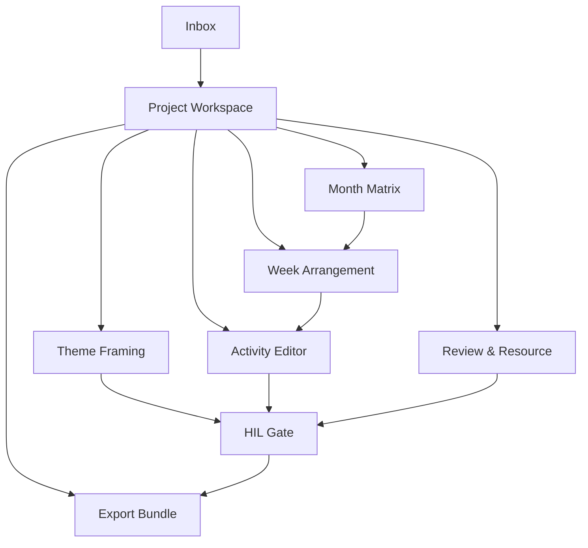

# 教研工坊页面级产品方案

## 1. 文档目的

本文件在《教研工坊-产品概念方案》的基础上，进一步定义：

- 页面清单
- 页面目标
- 页面结构
- 页面间的主路径关系
- 每个页面里 Co-pilot 如何发挥作用

本文件不讨论技术实现细节，重点回答“用户在每个页面做什么”。

## 2. P0 页面范围

教研工坊的第一阶段页面范围建议覆盖：

1. `Inbox`
2. `Project Workspace`
3. `Theme Framing`
4. `Month Matrix`
5. `Week Arrangement`
6. `Activity Editor`
7. `HIL Gate`
8. `Export Bundle`

`Review & Resource` 建议作为 P0.5 或 P1 接入，但在主路径中保留入口。

## 3. 页面总路径

主路径不是“找功能”，而是：

- 进入项目
- 定方向
- 排结构
- 补内容
- 过 gate
- 出交付

## 4. Inbox

### 4.1 页面目标

让用户一进入系统就知道：

- 我今天应该先做什么
- 哪些项目卡在我这里
- 哪些项目可以继续推进
- 哪些项目在等我确认

### 4.2 主要用户

- 课研主任
- 一线教师
- 交付负责人
- 园长 / 审批者

### 4.3 页面模块

1. 顶部筛选区
2. 我的待办
3. 我负责的项目
4. 等待 HIL 确认
5. 最近更新
6. Copilot Feed

### 4.4 关键卡片

- 等待我审批
- 被退回修改
- 待我补活动稿
- 可以进入导出
- 缺项较多的项目

### 4.5 页面交互

- 点击项目卡进入 Project Workspace
- 一键进入某个 gate
- 一键跳转到缺失的活动稿
- 按角色筛选待办

### 4.6 Copilot 在此页要做什么

- 总结今天最重要的 3 个动作
- 标出风险最高的项目
- 给出“最短推进路径”

示例：

- “`多样的服饰` 已完成主题网络，等待 `project-framing` 审核。”
- “`春天的花` 第 3 周还缺 1 个户外游戏，建议先补这个缺项。”

## 5. Project Workspace

### 5.1 页面目标

作为项目总控页，统一回答：

- 这个项目现在在哪个阶段
- 已经有什么产物
- 缺什么
- 下一步是什么
- 谁在参与

### 5.2 页面模块

1. 项目头部
2. 阶段条 / HIL Rail
3. Deliverables Overview
4. 关联 Plans
5. 参与人
6. 最近活动
7. Copilot Summary

### 5.3 Deliverable 卡片

- Theme Framing
- Month Matrix
- Week Arrangement
- Activities
- Review
- Export

每张卡要展示：

- 当前状态
- 已有产物
- 缺失项
- 最近更新时间
- 下一步 CTA

### 5.4 页面交互

- 进入各模块页面
- 查看 HIL 当前状态
- 发起下一阶段动作
- 跳到 review 或 export

### 5.5 Copilot 在此页要做什么

- 总结当前项目健康度
- 告诉用户最该先补什么
- 依据缺项生成动作卡

示例：

- “当前项目已完成 Theme Framing 和 Month Matrix，建议先展开第 2 周安排。”
- “你现在卡在 Deliverable Draft，建议先汇总 review 摘要再发起审批。”

## 6. Theme Framing

### 6.1 页面目标

完成主题方向确定：

- 主题值不值得做
- 如何对外表达
- 四周如何递进

### 6.2 页面模块

1. 主题摘要
2. Tab：
   - 主题分析
   - 主题解读
   - 主题网络
3. HIL 区域
4. Copilot 区域

### 6.3 核心动作

- 生成初稿
- 对照客户样例重写
- 补充递进逻辑
- 生成审核摘要
- 发起 `project-framing`

### 6.4 页面设计重点

- 这页强调“定方向”，不应过早卷入活动稿细节
- 主题网络最好有结构视图，不只给 Markdown

### 6.5 Copilot 在此页要做什么

- 判断主题是否过大、过散或过空
- 建议 4 周递进
- 把内部分析转成客户语言

## 7. Month Matrix

### 7.1 页面目标

把主题 framing 转成一个月课程结构。

### 7.2 页面模块

1. 4 周递进条
2. 月度活动矩阵
3. 活动类型覆盖分析
4. 材料预览
5. Copilot

### 7.3 核心交互

- 补齐某类活动
- 调整活动密度
- 从矩阵单元格创建活动
- 展开成周安排

### 7.4 页面设计重点

- 这是课研主任最核心的结构视图之一
- 页面要帮助用户“编排与校正”，而不只是展示一张表

### 7.5 Copilot 在此页要做什么

- 判断活动分布是否失衡
- 提醒哪周哪类活动偏少或偏密
- 一键生成建议补项

示例：

- “第 2 周缺少家园互动，建议围绕‘职业服饰’补一个家庭观察任务。”
- “第 3 周艺术活动偏多，建议替换其中一个为区域活动。”

## 8. Week Arrangement

### 8.1 页面目标

把月矩阵展开成一周 15-17 项可执行安排。

### 8.2 页面模块

1. 周标题区
2. 线性活动列表
3. 按天视图
4. 材料清单
5. 教师备忘
6. Copilot

### 8.3 核心交互

- 拖拽调整顺序
- 替换活动类型
- 一键补项
- 一键生成活动稿

### 8.4 页面设计重点

- 默认主视图应为线性列表，因为它更贴近真实编排逻辑
- 按天视图是次视图，用于校验节奏和执行感

### 8.5 Copilot 在此页要做什么

- 识别节奏问题
- 识别缺失项
- 自动补全周安排

示例：

- “周三还缺一个生活渗透活动，我可以先补一版。”
- “这个周安排里教学活动连续出现 3 次，节奏偏硬，要不要换成区域活动？”

## 9. Activity Editor

### 9.1 页面目标

围绕单个活动进行深度共创。

### 9.2 页面模块

1. 活动元信息条
2. 结构化编辑区
3. Copilot 共创区
4. 评论与版本区

### 9.3 核心交互

- 局部重写
- 只改某个 section
- 补教师观察与支持要点
- 生成新版本
- 对照客户模板重写

### 9.4 页面设计重点

- 不能只是一个大富文本框
- 必须按 section 组织
- 教学活动过程表应被单独设计

### 9.5 Copilot 在此页要做什么

- 重写某一段，而不是整篇重写
- 解释修改理由
- 对齐年龄段、客户语言、教学节奏

示例：

- “把这节活动改得更适合中班”
- “只重写第 2 环节，不动其他部分”
- “补观察与支持要点”

## 10. HIL Gate

### 10.1 页面目标

让关键决策被明确处理，而不是隐含在状态字段里。

### 10.2 页面模块

1. Gate 摘要
2. 当前待确认对象
3. 风险摘要
4. 评论区
5. 操作按钮

### 10.3 操作

- 通过
- 退回修改
- 补充说明
- 指派他人

### 10.4 页面设计重点

- 这是治理页面，不是普通确认弹窗
- 必须说明“现在确认什么”和“通过/退回后会发生什么”

### 10.5 Copilot 在此页要做什么

- 生成审批摘要
- 总结主要风险
- 生成建议通过 / 退回理由

## 11. Review & Resource

### 11.1 页面目标

在进入最终审批前，把质量结果和资源准备结果汇总到一起。

### 11.2 页面模块

1. Quality Summary
2. Review Comments
3. Resource Plan
4. Resource Check
5. Copilot

### 11.3 页面价值

- 帮用户判断是否具备进入 `approval-gate` 的条件
- 把“内容质量”和“执行准备”放在一个判断视图里

## 12. Export Bundle

### 12.1 页面目标

把项目工程转成客户可交付包。

### 12.2 页面模块

1. Release Bundle 预览
2. Export Target 切换
3. Manifest 预览
4. 客户模板检查
5. 导出说明
6. Copilot

### 12.3 Target

- Word-ready
- PDF-ready
- Remote-ready

### 12.4 页面设计重点

- 要让用户理解 `project workspace`、`release bundle`、`export bundle` 的区别
- 导出不应是黑盒

### 12.5 Copilot 在此页要做什么

- 判断是否已满足导出条件
- 生成交付说明
- 提醒仍然缺失的内容

## 13. 页面之间的主逻辑

页面设计的核心不是“把所有功能都摆出来”，而是围绕一条主路径组织：

- 项目进入
- 主题 framing
- 月周编排
- 活动共创
- HIL 审核
- 导出交付

这保证“教研工坊”始终像一个连续推进的工作台，而不是插件功能集合页。

## 14. 页面级结论

如果这些页面设计得当，用户感知到的就不是：

- 一堆插件
- 一堆 markdown 文件
- 一个会聊天的 AI

而是：

- 一个知道我在做什么
- 能推动项目往前走
- 能在关键节点拉人确认
- 能把过程和交付都组织好的工作台
