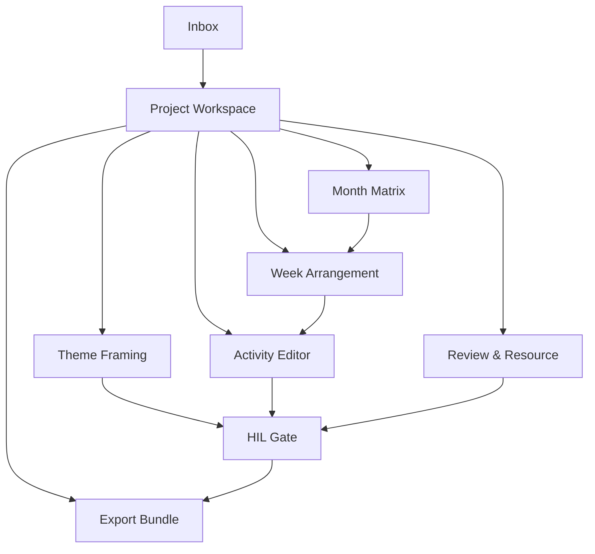

# 教研工坊页面级产品方案

## 1. 文档目的

本文件在《教研工坊-产品概念方案》的基础上，进一步定义：

- 页面清单
- 页面目标
- 页面结构
- 页面间的主路径关系

本文件不讨论技术实现细节，重点回答“用户在每个页面做什么”。

## 2. P0 页面范围

教研工坊的第一阶段页面范围建议覆盖：

1. `Inbox`
2. `Project Workspace`
3. `Theme Framing`
4. `Month Matrix`
5. `Week Arrangement`
6. `Activity Editor`
7. `HIL Gate`
8. `Export Bundle`

## 3. 页面总路径

## 4. Inbox

### 页面目标

让用户一进入系统就知道：

- 我今天应该先做什么
- 哪些项目卡在我这里
- 哪些项目可以继续推进

### 页面模块

1. 顶部筛选区
2. 我的待办
3. 我负责的项目
4. 等待 HIL 确认
5. 最近更新
6. Copilot Feed

### 关键卡片

- 等待我审批
- 被退回修改
- 待我补活动稿
- 可以进入导出

## 5. Project Workspace

### 页面目标

作为项目总控页，统一回答：

- 这个项目现在在哪个阶段
- 已经有什么产物
- 缺什么
- 下一步是什么

### 页面模块

1. 项目头部
2. 阶段条 / HIL Rail
3. Deliverables Overview
4. 关联 Plans
5. 参与人
6. 最近活动
7. Copilot Summary

### Deliverable 卡片

- Theme Framing
- Month Matrix
- Week Arrangement
- Activities
- Review
- Export

## 6. Theme Framing

### 页面目标

完成主题方向确定：

- 主题值不值得做
- 如何对外表达
- 四周如何递进

### 页面模块

1. 主题摘要
2. Tab：
   - 主题分析
   - 主题解读
   - 主题网络
3. HIL 区域
4. Copilot 区域

### 核心动作

- 生成初稿
- 对照客户样例重写
- 补充递进逻辑
- 发起 `project-framing`

## 7. Month Matrix

### 页面目标

把主题 framing 转成一个月课程结构。

### 页面模块

1. 4 周递进条
2. 月度活动矩阵
3. 活动类型覆盖分析
4. 材料预览
5. Copilot

### 核心交互

- 补齐某类活动
- 调整活动密度
- 展开成周安排

## 8. Week Arrangement

### 页面目标

把月矩阵展开成一周 15-17 项可执行安排。

### 页面模块

1. 周标题区
2. 线性活动列表
3. 按天视图
4. 材料清单
5. 教师备忘
6. Copilot

### 核心交互

- 拖拽调整顺序
- 替换活动类型
- 一键补项
- 一键生成活动稿

## 9. Activity Editor

### 页面目标

围绕单个活动进行深度共创。

### 页面模块

1. 活动元信息条
2. 结构化编辑区
3. Copilot 共创区
4. 评论与版本区

### 核心交互

- 局部重写
- 只改某个 section
- 补教师观察与支持要点
- 生成新版本

## 10. HIL Gate

### 页面目标

让关键决策被明确处理，而不是隐含在状态字段里。

### 页面模块

1. Gate 摘要
2. 当前待确认对象
3. 风险摘要
4. 评论区
5. 操作按钮

### 操作

- 通过
- 退回修改
- 补充说明
- 指派他人

## 11. Export Bundle

### 页面目标

把项目工程转成客户可交付包。

### 页面模块

1. Release Bundle 预览
2. Export Target 切换
3. Manifest 预览
4. 客户模板检查
5. 导出说明
6. Copilot

### Target

- Word-ready
- PDF-ready
- Remote-ready

## 12. 页面设计结论

页面设计的核心不是“把所有功能都摆出来”，而是围绕一条主路径组织：

- 项目进入
- 主题 framing
- 月周编排
- 活动共创
- HIL 审核
- 导出交付

这保证“教研工坊”始终像一个连续推进的工作台，而不是插件功能集合页。
