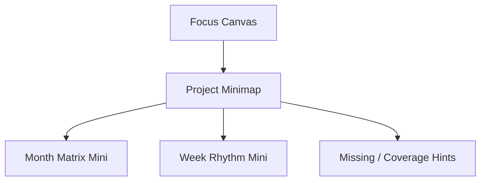
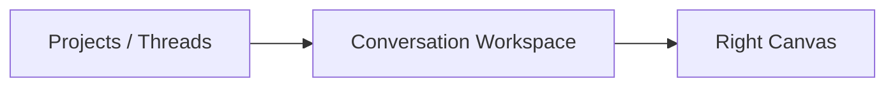
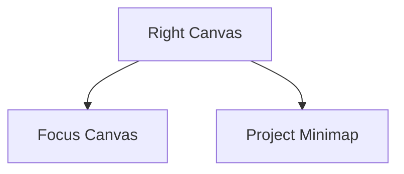

# 教研工坊-页面视觉与交互设计稿 V2.2

## 1. 这次迭代解决什么问题

V2.1 已经解决了几个关键结构问题：

- 左侧回归 `project / thread`
- 顶部显式展示 `stage map`
- `confirm` 作为 gate 可见
- `week -> activities(N)` 的展开关系被讲清楚

但它也带来了一个明显代价：

- 右侧画布过于聚焦当前阶段
- V1 中最有产品力的两块结构视图被弱化了：
  - 月度活动矩阵
  - 周安排节奏与缺项

这会带来一个问题：

- 用户虽然沉浸在当前对话里
- 但很容易丢失“整个课程包现在长什么样”的结构感

所以 V2.2 的目标是：

**保留 V2 的单人沉浸式 Co-pilot 创作体验，同时把 V1 的结构亮点以缩略引用的方式重新接回右侧画布。**

---

## 2. 核心设计判断

### 2.1 右侧不应该只有“当前阶段结果”

在 V2.1 中，右侧几乎被当前阶段产物占满，比如：

- framing 页只看 theme framing
- activity 页只看当前 activity

这会让用户失去对整个项目结构的实时感知。

### 2.2 右侧应该变成“双层画布”

右侧从单一 `Current Canvas` 改成：

1. **Focus Canvas**
   - 当前阶段最成熟的结构化结果

2. **Project Minimap**
   - 月矩阵缩略图
   - 周安排节奏条
   - 当前所处位置
   - 缺项提醒

也就是说，右侧不再只是“当前内容”，而是：

- 当前内容
- 当前内容在整条课程 pipeline 里的位置

### 2.3 V1 亮点不再作为独立主画面，而作为“结构雷达”

V1 的亮点：

- Month Matrix 的结构平衡感
- Week Arrangement 的节奏感和缺项感

V2.2 不把它们重新搬回主区，而是把它们压缩成：

- 持续可见的项目结构雷达

这比完全隐藏更好，也比让它重新占主舞台更平衡。

---

## 3. 新的右侧结构



### 3.1 Focus Canvas

仍然用于承载：

- 当前阶段结果
- 当前 thread 正在打磨的对象

例如：

- Theme Framing
- Month Matrix 当前展开部分
- Week Arrangement 当前周
- Activity 当前稿件
- Export 当前 bundle

### 3.2 Project Minimap

固定出现在右侧下半区，承担 3 个作用：

1. 告诉用户整个项目现在推进到了哪里
2. 提醒当前阶段和月/周结构的关系
3. 让用户随时看见缺项和结构失衡

---

## 4. Project Minimap 的组成

### 4.1 Month Matrix Mini

不是完整矩阵，而是缩略版矩阵状态图。

显示内容：

- 4 周
- 每周的活动类型覆盖热度
- 当前 thread 关联的周次高亮

表现形式建议：

- 4 行简化矩阵
- 每行只保留小色块和关键活动类型缩写

例如：

```text
W1  T R O L H
W2  T R O L -
W3  T R - L H
W4  T R O - H
```

其中：

- `T` = teaching
- `R` = region
- `O` = outdoor
- `L` = life-routine
- `H` = home-school
- `-` = 缺失

### 4.2 Week Rhythm Mini

不是完整周表，而是节奏雷达。

显示内容：

- 当前周每天的强弱分布
- 当前周缺失项
- 当前 thread 影响到哪一天

建议形式：

- 周一到周五的小节奏条
- 每天用 2-4 个短条表示活动密度
- 高强度天标橙
- 缺项天标红点

例如：

```text
Mon ▮▮
Tue ▮▮▮ !
Wed ▮▮ ·
Thu ▮▮▮
Fri ▮▮
```

其中：

- `!` = 节奏偏密
- `·` = 有缺项待补

### 4.3 Missing / Coverage Hints

这是最轻的提示层。

显示：

- 本周缺 1 个生活渗透
- 第 3 周户外活动偏少
- 当前 activity 属于 Week 2 / Teaching

---

## 5. 页面整体结构升级

V2.2 的三栏主结构不变：



但右栏改成：



这意味着：

- 左侧仍是项目/会话管理
- 中间仍是对话主区
- 右侧变得更“有全局意识”

---

## 6. 各页面如何接入 Minimap

### 6.1 Studio 首页

右侧：

- 上：当前 project snapshot
- 下：Month Matrix Mini + 最近活跃周次

作用：

- 一进入项目就能看到它的大致结构成熟度

### 6.2 Theme Framing 页面

右侧：

- 上：Theme Analysis / Narrative / Network
- 下：Month Matrix Mini（灰态或建议态）

作用：

- 让用户知道：
  - 当前虽然在 framing
  - 但 framing 的结果最终会流向 month structure

### 6.3 Month Matrix 页面

右侧：

- 上：当前矩阵的 focus 区块
- 下：Week Rhythm Mini

作用：

- 从“月矩阵”直接看到“周节奏”
- 提前预见 week 展开后的问题

### 6.4 Week Arrangement 页面

右侧：

- 上：当前 week 安排
- 下：
  - Month Matrix Mini（高亮当前周）
  - Week Rhythm Mini（完整显示）

这是 V2.2 最重要的页面增强。

原因：

- 它把 V1 的两个亮点重新结合了
- 用户在调一周节奏时，不会丢失整个月的位置

### 6.5 Activity Editor 页面

右侧：

- 上：当前活动稿
- 下：
  - Month Matrix Mini（高亮当前活动所在周）
  - Week Rhythm Mini（指出它在周中的位置）

作用：

- 防止 activity 编辑变成“脱离周结构的单稿写作”

### 6.6 Stage Confirm 页面

右侧：

- 上：阶段快照
- 下：
  - Month Matrix Mini
  - Week Rhythm Mini
  - 当前缺项

作用：

- 用户在确认阶段结果时，能同时看到全局结构是否完整

### 6.7 Export Bundle 页面

右侧：

- 上：Bundle Tree / Manifest
- 下：
  - 结构完整度摘要
  - 哪些内容进入 release bundle

这里 Minimap 可以弱化，但仍保留项目结构摘要。

---

## 7. 关键页面升级重点

## 7.1 Theme Framing 页面

### V2.2 要点

- 不再只看 framing 结果
- 右下角要出现“未来矩阵预影”

用户感受：

- 我现在虽然在聊主题
- 但我已经能隐约看到这个主题会如何长成月矩阵

## 7.2 Month Matrix 页面

### V2.2 要点

- 右侧不仅显示月矩阵 focus
- 还要显示周节奏预影

用户感受：

- 我不是只在排表
- 我已经能提前看到 week 的执行节奏

## 7.3 Week Arrangement 页面

### V2.2 要点

这是最值得重点打磨的页。

右侧应分三层：

1. 当前 week arrangement
2. Month Matrix Mini
3. Week Rhythm Mini

用户感受：

- 我在改一周
- 但我一直知道它在整个月里的位置
- 我也知道这一改会不会影响整个月的结构平衡

## 7.4 Activity Editor 页面

### V2.2 要点

用户写某个 activity 时，最容易失去整体感。
Minimap 的作用就是防止这种“局部沉没”。

用户感受：

- 我在改一节活动
- 但我知道它属于哪一周、这一周节奏怎么样、整个月覆盖是否完整

---

## 8. 视觉建议

### 8.1 Minimap 要明显是“缩略引用”，不是第二个主舞台

所以视觉上要：

- 尺寸更紧凑
- 信息更抽象
- 用色块、短条、点位代替大段文本

### 8.2 Focus Canvas 和 Minimap 要有主次

- Focus Canvas：高对比、主信息、可编辑
- Minimap：低饱和、摘要化、可点击跳转但不喧宾夺主

### 8.3 Minimap 最好可点击

例如：

- 点 `Week 2` 直接切到当前周
- 点 `缺 home-school` 直接生成相应 thread 建议

---

## 9. 为什么这版比 V2 更好

V2 解决的是：

- 沉浸感
- 单人创作
- project / thread

但 V2 丢掉了：

- 结构雷达
- 月周层面的产品亮点

V2.2 的提升在于：

- 保留沉浸式对话
- 不回退成任务工作台
- 但重新把结构和节奏感接回来

它不是回到 V1，而是：

**把 V1 的结构视图压缩成 V2 的右侧结构雷达。**

---

## 10. 结论

V2.2 的产品判断是：

**把教研工坊做成一个带有 Project / Thread 管理能力、以对话为主驱动、但始终保留“课程结构雷达”的单人沉浸式 Co-pilot 创作台。**

一句话概括：

- V1 像项目控制台
- V2 像 AI 创作工作室
- **V2.2 像带结构导航雷达的 AI 课程创作 IDE**
