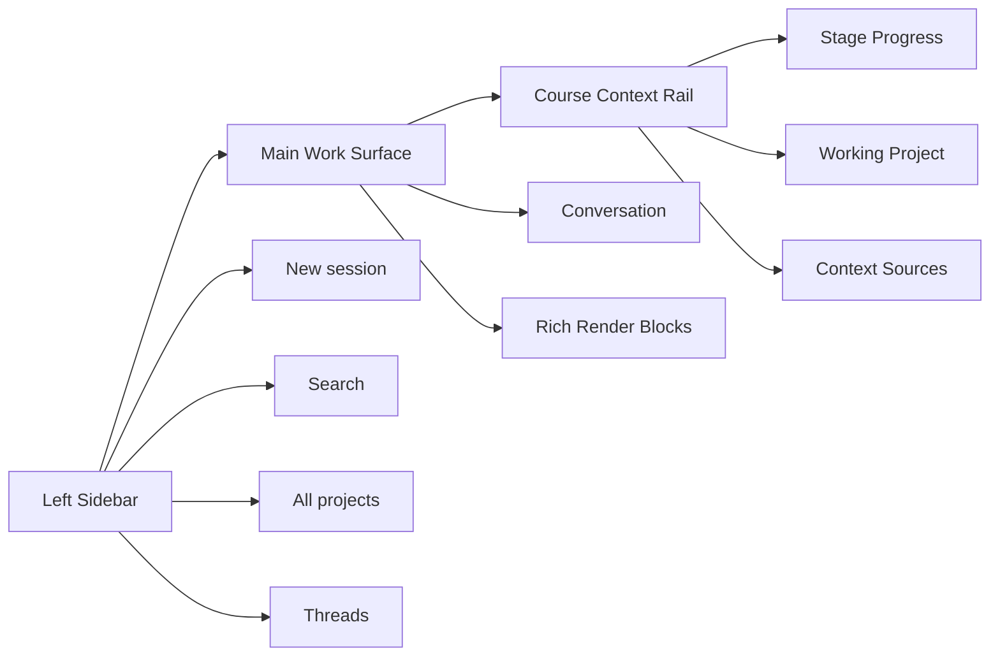

# 教研工坊-页面视觉与交互设计稿 V2.4

## 1. 版本定位

V2.4 回到第二版的主线，但进一步借鉴 Claude 的产品思想：

- `Project / Thread` 是第一等公民
- 中间区是 **rich-rendered conversation surface**，不是单一聊天流
- 右侧是 **Course Context Rail**，持续显示进度、工作对象和引用上下文
- 初始态、starter 选中态、create project 分支态、正式工作态构成完整启动链路

一句话：

**V2.4 = 像 Claude 一样工作的教研 Co-pilot。**

---

## 2. 关键设计判断

### 2.1 Project 是上下文容器

用户不是在一个抽象 AI 里提问，而是在某个课程 project 里持续推进工作。

### 2.2 Thread 是工作轨迹

thread 不是任务卡，而是一段连续设计线索，例如：

- 继续主题 framing
- 调整第 2 周结构
- 重写教学活动第 2 环节

### 2.3 中间区不是纯聊天

中间区应混合出现：

- 对话气泡
- 主题结构块
- 月矩阵块
- 周节奏块
- 活动稿 section 块
- 阶段确认卡
- 导出块

### 2.4 右侧不是“大结果窗”，而是 Context Rail

右侧固定承载三类信息：

- `Stage Progress`
- `Working Project`
- `Context Sources`

### 2.5 初始态要可启动，不要直接丢空白输入框

用户第一次进入时，需要：

- starter cards
- project selector
- create project 分支入口

---

## 3. 整体结构



---

## 4. 关键状态

## 4.1 Empty State

目标：

- 解释产品是什么
- 让用户能开始第一个 project
- 提供 starter cards 降低启动成本

中间区应包含：

- Hero 标题
- 主输入框
- `Work in a project` 选择器
- starter cards

建议文案：

- 标题：`把一个主题想法变成课程结构`
- 副标题：`从主题 framing 到月矩阵、周安排、活动稿，Copilot 会陪你一步步推进。`

starter cards 建议：

- 创建一个主题课程项目
- 继续一个课程 thread
- 从月矩阵开始排结构
- 补一节活动稿

---

## 4.2 Starter Selected State

当用户点某个 starter 后，中间区应进入 **启动草稿态**。

这个状态不是直接开始执行，而是：

- 预填充一段“可编辑的启动说明”
- 允许用户补充目标和限制
- 选择 project 或创建新 project
- 再点击开始

例如点“创建一个主题课程项目”后，自动生成：

```text
帮我创建一个新的主题课程项目。

请先帮我完成：
- 主题分析
- 主题解读
- 四周递进建议

开始前请确认：
- 主题名称
- 年龄段/班级
- 是否对齐客户模板
- 希望采用哪种课程 pipeline
```

---

## 4.3 Create Project Entry State

点击 `Create your first project` 后，弹出 `Create a new course project` modal。

三条路径：

1. 从零开始一个课程项目
2. 导入已有课程资料
3. 连接现有课程工作区

### A. 从零开始一个课程项目

字段：

- 项目名称
- 主题名称
- 年龄段 / 班级
- 课程类型
- 默认 pipeline
- 可选说明
- 可选参考资料上传

### B. 导入已有课程资料

字段：

- 导入文件
- 资料类型（客户模板 / 往期主题包 / 活动稿 / 样例）
- 新建 project 名称
- 是否同步导入 KB

### C. 连接现有课程工作区

字段：

- 选择目录
- 自动检测 `.workshop`
- 恢复已有 projects / threads / artifacts

---

## 4.4 Active Thread State

正式进入工作区后的主状态。

### 左侧

- All projects
- 当前 project
- 当前 project 下的 threads

### 中间

rich-rendered conversation surface

可以混合出现：

- 对话
- 主题结构块
- 月矩阵表
- 周节奏块
- 活动稿 section
- confirm card

### 右侧 Course Context Rail

#### Stage Progress

- Theme Framing
- Month Matrix
- Week Arrangement
- Activities
- Export

并可附加当前阶段内部展开程度，例如：

- `3 / 5 activities drafted`

#### Working Project

- Project 名称
- Pipeline
- 当前对象
- Workspace 路径

#### Context Sources

- theme-narrative
- month-plan
- week-plan
- client template
- KB sample

---

## 5. 中间区的丰富渲染块

## 5.1 阶段摘要块

用于说明：

- 当前阶段
- 当前目标
- 当前缺项
- 建议下一步

## 5.2 主题结构块

- 主题分析
- 主题解读
- 主题网络
- 四周递进卡

## 5.3 月矩阵块

在 thread 中直接渲染矩阵，而不是跳出到另一套后台。

## 5.4 周节奏块

- 周一到周五节奏条
- 缺项提示
- 锚点活动

## 5.5 活动稿块

- 目标
- 准备
- 活动过程
- 教师观察与支持

## 5.6 Confirm Card

在会话流中插入：

- `这版 Theme Framing 已稳定`
- `[接受这版] [继续细化] [换一个方向]`

## 5.7 Export Block

- bundle tree
- manifest 摘要
- 哪些内容进入正式包

---

## 6. Course Context Rail 设计

这是 V2.4 相对之前版本新增的关键能力。

### 6.1 Stage Progress

回答：

- 现在做到哪一步
- 当前阶段内部展开到什么程度

### 6.2 Working Project

回答：

- 当前 thread 落在哪个 project
- 当前正在修改哪个对象
- 写入哪个 workspace

### 6.3 Context Sources

回答：

- AI 本次基于哪些上下文工作
- 为什么生成成这样

---

## 7. 配色与视觉

V2.4 明确参考 Claude 的整洁灰黑风格。

建议色板：

- Background: `#1f1f1d`
- Surface: `#2a2a28`
- Panel: `#30302d`
- Border: `rgba(255,255,255,0.08)`
- Text: `#f3f4f6`
- Muted: `#a1a1aa`
- Accent: `#7dd3fc`
- CTA: `#86efac`

原则：

- 压低界面 chrome
- 让中间内容块成为主角
- 避免过强教育感插画和高饱和色块

---

## 8. 页面建议

V2.4 建议至少覆盖：

- `empty-state`
- `starter-selected`
- `create-project`
- `create-project-scratch`
- `create-project-import`
- `create-project-existing`
- `studio-thread`

这 7 个状态能完整表达产品链路。

---

## 9. 结论

V2.4 的产品定义是：

**一个以 Project / Thread 为容器、以对话推进为主、以富结果渲染为核心工作面、并通过 Context Rail 显式展示阶段与上下文的教研 Co-pilot 工作台。**
