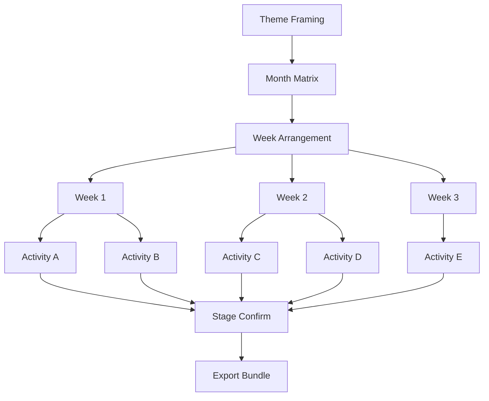
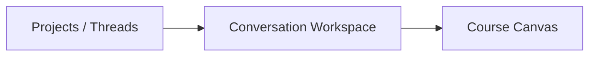
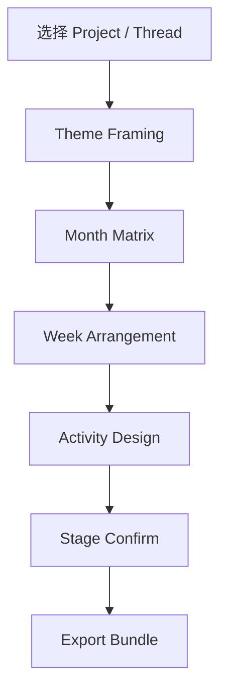

# 教研工坊-页面视觉与交互设计稿 V2

## 1. 方向说明

这一版是相对于 V1 的另一条产品方向尝试，核心变化有四点：

1. 从“任务驱动工作台”转为“单人沉浸式课程创作台”
2. 从“看板 + 卡片 + 待办”转为“项目 / 会话 + 对话 + 画布”
3. 从“多人协作审批”转为“人对 AI 阶段成果的确认”
4. 从“左侧 pipeline 导航”转为“左侧 project / thread 管理，顶部显示阶段地图”

对应的核心判断是：

- 用户不是来处理一堆任务，而是来连续完成一个课程设计
- 用户同时仍然会有多个 project，要能像使用 Codex 一样在 project 和 thread 之间切换
- HIL 更像“阶段确认”，不是审批流中心，但必须能被明确看见
- pipeline 不是纯 1:1 直线流，它本质上是“阶段 + 展开关系”

## 2. 先澄清 pipeline 的结构关系

### 2.1 不是所有环节都是 1:1

你提出的第 3 点是对的。
在 `course-workshop` 里，前端不应该把 pipeline 错画成每一步都 1:1 串行。

更准确的结构是：

也就是说：

- `Theme Framing` 是主题级阶段
- `Month Matrix` 是月结构阶段
- `Week Arrangement` 是周编排阶段
- 一个 `week` 会展开成多个 `activity`
- `confirm` 不是一个普通内容阶段，而是对当前阶段结果的确认

### 2.2 Confirm 是否算 pipeline 环节

我的判断：

- **它不应该算“内容生产阶段”**
- **但应该是“阶段地图中显式可见的 gate”**

所以 V2.1 的处理是：

- 顶部显示 `Stage Map`
- 内容阶段和确认 gate 都可见
- 但视觉上明确区分：
  - 内容阶段
  - 阶段确认

## 3. 设计基调

基于 `ui-ux-pro-max` 的结果，这一版采用：

- 主结构：**AI-Native UI**
- 页面组织：**editor workspace**
- 视觉语言：轻玻璃层次 + 清晰结构 + 最小 chrome

### 3.1 为什么不再把 pipeline 放左边

你指出的第 4 点是关键：

- 左侧在 Codex、Claude Code 这类产品中，天然更适合承载：
  - project
  - thread
  - session
  - 历史上下文

所以 V2.1 要把左侧改成：

- 当前项目
- 项目切换
- 当前会话
- 相关会话

而不是 pipeline 导航。

### 3.2 颜色建议

- Primary: `#6366F1`
- Accent: `#06B6D4`
- Surface: `rgba(255,255,255,0.78)`
- Ink: `#1E293B`
- Background: `#F8FAFC`

比之前更偏 AI-native workspace，而不是沉重的 spatial demo。

## 4. 总体结构

### 4.1 三栏关系

- 左侧：Projects / Threads
- 中间：Conversation Workspace
- 右侧：Course Canvas

### 4.2 顶部加一条 Stage Map

顶部不再是“页面标题 + 状态标签”就结束，而是增加一条当前项目的阶段地图。

它的作用：

- 告诉用户当前在整体流程中的哪里
- 表达阶段之间的展开关系
- 提醒当前是否需要 confirm

## 5. 核心结构调整

### 5.1 左侧：Project / Thread 管理

这是 V2.1 最重要的改动之一。

左侧应该包含：

- 当前项目列表
- 当前项目下的会话列表
- 新建 project
- 新建会话

这样用户才能在多个项目之间切换，而不会丢失沉浸式体验。

### 5.2 中间：对话是主体验，但不是全部

中间仍然是主对话区，但它要承担的是：

- 用户给出设计意图
- AI 推进当前阶段
- 用户对 AI 的局部结果给反馈

它不是“闲聊区”，而是围绕当前项目的工作对话。

### 5.3 右侧：Current Canvas

右侧永远显示“当前阶段最成熟的结构化结果”。

例如：

- framing 阶段：分析 / 解读 / 网络
- month 阶段：月矩阵
- week 阶段：周安排
- activity 阶段：结构化活动稿
- export 阶段：bundle tree + manifest

## 6. 页面结构总览

### 6.1 主路径

### 6.2 注意：Week -> Activities 是展开关系

这一点需要明确反映在页面上：

- `Week Arrangement` 不代表一个页面只对应一个活动
- 它应该像一个“列表展开台”
- 用户从某一周进入多个活动稿

## 7. 首页 / Studio 页面

### 目标

不再做任务 inbox，而是做“继续创作”的入口。

### 页面重点

- 左侧展示多个 project
- 每个 project 下有多个 thread
- 中间显示当前会话
- 右侧显示当前 project 的最近结果快照

### 用户感受

- 像切换 Codex thread 一样切换课程项目
- 但一旦进入某个 project，又能保持深度沉浸

## 8. Theme Framing 页面

### 目标

让用户通过和 AI 对话完成：

- 主题分析
- 主题解读
- 主题网络

### V2.1 调整

- 左侧仍然保留 project / thread
- 顶部显示 `Stage Map`
- `Project Framing` 作为当前阶段高亮
- `Confirm` 作为一个即将到来的 gate 节点，而不是单独流程页的唯一线索

## 9. Month Matrix 页面

### 目标

让用户在与 AI 对话中共同完成月矩阵编排。

### V2.1 调整

- 页面强调“阶段地图”和“当前矩阵所处阶段”
- 右侧矩阵仍是主画布
- 上方要明确告诉用户：
  - 这是 month 级阶段
  - 下一步会进入 week 展开

## 10. Week Arrangement 页面

### 目标

通过和 AI 对话，把月矩阵展开成周安排。

### V2.1 调整重点

- 顶部 Stage Map 明确显示：
  - 当前在 Week Arrangement
  - 下一步会进入 Activities
- 右侧画布不只是“一个周表”，而要显示：
  - 当前 week
  - 本周展开的活动列表
  - 哪些活动已经生成稿件

这样用户能理解：

- week 是一个“容器阶段”
- activity 是从 week 展开的多个对象

## 11. Activity Editor 页面

### 目标

保留最强的 Co-pilot 感。

### V2.1 调整

- 左侧 thread 更重要，因为用户可能为同一个项目开多个活动设计会话
- 顶部阶段地图明确显示：
  - 当前在 Activity Design
  - Confirm 即将发生
- 右侧显示当前活动稿，而不是抽象“阶段结果”

## 12. Stage Confirm 页面

### 目标

不做“审批中心”，而做“阶段确认页”。

### V2.1 调整

- 文案从 `HIL Confirm` 更明确为 `Stage Confirm`
- 它不是 pipeline 的普通节点，而是阶段地图中的 gate
- 页面要说明：
  - 你确认的是哪个阶段
  - 通过后会进入哪里
  - 退回后会回到哪里

## 13. Export Bundle 页面

### 目标

用户通过和 AI 对话确认导出目标，而不是进入一个运维式导出后台。

### V2.1 调整

- 左侧仍然是 project / thread，不换成 target 导航
- 顶部阶段地图走到 Export
- 右侧仍然是交付画布

## 14. V2.1 相对 V2 的优化总结

### 14.1 补回了 project / thread 概念

这解决了：

- 多个 project 如何切换
- 同一 project 多个会话如何管理

### 14.2 Clarify 了 pipeline 不是纯线性

这解决了：

- week 和 activity 的 1:N 关系表达不清

### 14.3 把 confirm 从“独立审批感”改成“显式 gate”

这解决了：

- 它到底算不算 pipeline 阶段的问题

### 14.4 左侧回归行业常识

这解决了：

- 左边不该放 pipeline，而应放 project / thread 管理

## 15. 结论

V2.1 的产品判断是：

**把教研工坊做成一个带有 Project / Thread 管理能力的单人沉浸式 Co-pilot 创作台。**

它兼顾了两件事：

- 保留像 Codex 一样的会话式沉浸创作体验
- 不丢失课程 pipeline 本身的结构表达

如果 V1 更像“项目控制台”，那 V2.1 更像“AI 课程创作 IDE”。
