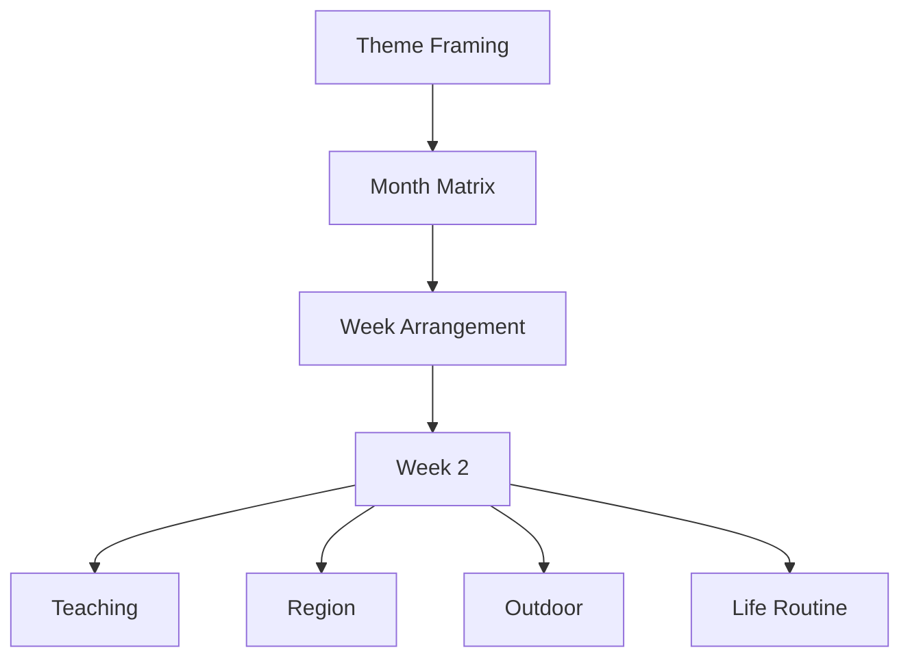
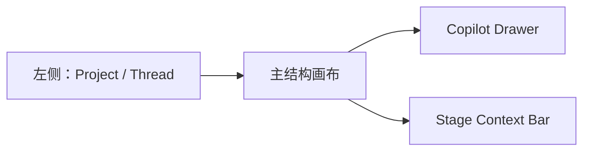

# 教研工坊-页面视觉与交互设计稿 V3

## 1. 版本定位

V3 不是 V2 的补丁版，而是新的主方向：

- 保留 V2 的 `Project / Thread` 管理和单人沉浸式 Co-pilot 体验
- 放弃“中间对话 + 右侧结果窗”的固定三栏主心智
- 恢复 V1 中真正有产品力的结构对象：
  - `Month Matrix`
  - `Week Arrangement`
- 把 Copilot 改成 **附着在结构对象上的 Drawer**

一句话：

**V3 = 结构画布优先的沉浸式 Co-pilot。**

---

## 2. 为什么需要 V3

V1 的强项是：

- 结构清楚
- 月矩阵和周节奏有控制感
- 用户能“看见整个课程在怎么长”

V2 的强项是：

- 路径清晰
- 单人沉浸式创作感更强
- 更像 Codex / Claude Code 这样的连续工作体验

但 V2 的核心问题是：

- 对话线程被抬成了主对象
- `Month Matrix` 和 `Week Arrangement` 被压成旁边结果
- 结构控制感下降

所以 V3 的关键判断是：

**对话不是主对象，结构画布才是主对象。**

---

## 3. 设计原则

### 3.1 左侧仍然是 Project / Thread

这一点保留 V2：

- 左侧用于多个 project 之间切换
- 左侧用于 thread 管理
- 左侧不承载 pipeline

### 3.2 主工作区回归“结构画布”

主工作区不再被拆成：

- 中间对话
- 右侧小结果

而是：

- **大结构画布**
- **附着式 Copilot Drawer**

### 3.3 Confirm 不是一个普通阶段

V3 中：

- `Theme / Month / Week / Activities / Export`
  是内容流
- `Confirm`
  是附着在这些内容流上的 gate

所以它更适合表达成：

- `Ready to Confirm`
- 或当前阶段顶部的确认状态

而不是与内容阶段同权的普通节点。

### 3.4 Week 和 Activity 不是 1:1

V3 要显式表达：

也就是：

- `Month` 是结构层
- `Week` 是容器层
- `Activity` 是展开层

---

## 4. 总体布局

### 4.1 左侧

- Project 列表
- 当前 project 的 threads
- 历史会话

### 4.2 Stage Context Bar

顶部固定显示：

- 当前阶段
- 当前对象
- 当前路径
- 是否 `Ready to Confirm`
- 当前结构风险

### 4.3 主结构画布

根据阶段不同切换：

- Theme canvas
- Month matrix
- Week arrangement
- Activity editor
- Export bundle

### 4.4 Copilot Drawer

Copilot 不再是一个固定结果侧栏，而是：

- 附着在当前结构对象上的工作抽屉
- 围绕选中的结构位进行对话和动作建议

---

## 5. 页面设计

## 5.1 Studio 首页

### 主对象

课程结构地图，而不是 inbox 任务列表。

### 页面意图

用户一进项目就应该看到：

- 主题结构
- month 层级
- 当前在处理哪个 week
- 哪些 activity 已经展开

### 交互

- 点结构地图进入对应阶段
- 点某个周进入 week thread
- 点某个活动进入 activity thread

---

## 5.2 Theme Framing

### 主对象

- 主题递进结构
- 主题网络
- 主题解读

### Copilot 的位置

附着在当前选中的结构块上，比如：

- Week 2 的递进说明
- 主题价值段落
- 主题网络某一条主线

### 设计重点

当前阶段不是写一篇长文，而是把 month 会如何生长的边界定清楚。

---

## 5.3 Month Matrix

### 主对象

**完整可操作的月度活动矩阵**

这页必须恢复为主舞台，不能退化成缩略图。

### 页面重点

- 4 周递进
- 多活动类型矩阵
- 当前选中的格子
- 与 week 展开的关系

### Copilot 的工作方式

不是讨论整个页面，而是围绕：

- `Week 2 / 区域活动`
- `Week 3 / 户外游戏`
- `Week 2 / 生活渗透待补`

这种结构位给出建议。

---

## 5.4 Week Arrangement

### 主对象

**整周节奏**

V3 中，Week Arrangement 的主舞台应该由两部分组成：

1. 周节奏条
2. 活动清单

### 这里最重要的不是文稿，而是：

- 哪天太密
- 哪天太空
- 缺哪类活动
- 哪个是本周锚点活动

### Copilot 的工作方式

围绕：

- 某一天节奏
- 某类活动缺项
- 某个锚点活动位置

做局部建议。

---

## 5.5 Activity Editor

### 主对象

单个活动的结构化稿件。

### 保留 V2 的优点

这里可以最像 Codex：

- 强对话
- 局部改写
- 围绕 section 编辑

### 但与 V2 的区别

它不会脱离整体结构。

页面顶部始终保留：

- 所在主题
- 所在 week
- 所在结构位

例如：

`多样的服饰 > Week 2 > 教学活动 > 这是谁的衣服`

---

## 5.6 Ready to Confirm

### 定位

不是新的生产阶段，而是当前成果的 gate。

### 页面作用

- 总结当前成果
- 说明当前缺项
- 判断是否足够进入 export

### Copilot 的作用

帮助用户回答：

- 为什么这版可以通过
- 为什么这版应该退回
- 哪些缺项不阻塞、哪些会阻塞

---

## 5.7 Export Bundle

### 主对象

不是后台式导出列表，而是：

**本次交付如何从当前结构成果中抽出 release bundle**

### 页面重点

- bundle tree
- manifest
- 正式交付物 vs 内部资产

### Copilot 的作用

帮助用户决定：

- 哪些进入交付包
- 哪些留在内部层

---

## 6. 交互心智

V3 的核心交互不是：

- 聊天后看结果

而是：

- 先看结构对象
- 选中结构对象
- 围绕该对象与 Copilot 对话
- 局部修改结构
- 再推进到下一层

也就是：

---

## 7. 视觉判断

### 7.1 画布优先

主画布要大、稳定、可读。

### 7.2 Drawer 次之

Copilot Drawer 虽然常驻，但不再抢主舞台。

### 7.3 结构比任务更重要

页面应尽量避免：

- 到处是待办卡片
- 到处是审批提示

而应突出：

- 当前结构
- 当前选中对象
- 当前缺口

---

## 8. V3 相对 V2 的变化总结

V2 的主问题是：

- 对话太强，结构变弱

V3 的修正是：

- 结构回到主舞台
- 对话变成结构编辑工具

所以 V3 不是把 V1 和 V2 并排，而是：

**把 V1 的结构控制感和 V2 的沉浸式对话体验，统一到“结构画布优先”这一个心智里。**

---

## 9. 原型页面建议

V3 原型建议至少包含：

- `index.html`
- `theme-framing.html`
- `month-matrix.html`
- `week-arrangement.html`
- `activity-editor.html`
- `hil-confirm.html`
- `export-bundle.html`

这样可以完整体现：

- project / thread
- 结构画布
- Copilot drawer
- confirm gate
- export bundle

---

## 10. 结论

V3 的最终定位是：

**一个以课程结构画布为主、以 Copilot Drawer 为辅、保留 Project / Thread 管理能力的单人沉浸式教研创作工作台。**
