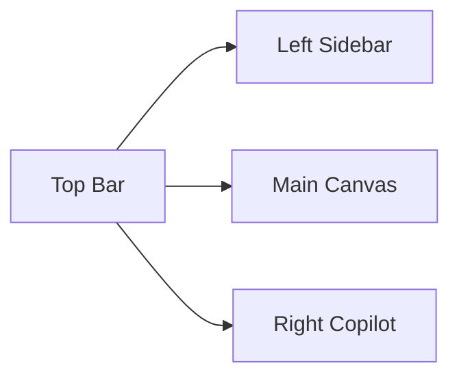

# 教研工坊页面视觉与交互设计稿

## 1. 文档目的

本文件基于：

- [教研工坊-产品概念方案.md](/Users/liuyameng/.codex/worktrees/8a4e/courses-workshop-plugins/docs/design/教研工坊-产品概念方案.md)
- [教研工坊-页面级产品方案.md](/Users/liuyameng/.codex/worktrees/8a4e/courses-workshop-plugins/docs/design/教研工坊-页面级产品方案.md)
- [教研工坊-组件与交互设计.md](/Users/liuyameng/.codex/worktrees/8a4e/courses-workshop-plugins/docs/design/教研工坊-组件与交互设计.md)

进一步把“页面线框图说明稿”落到可执行的页面视觉与交互方案，重点回答：

- 每个页面长什么样
- 视觉系统如何统一
- Copilot 在不同页面如何上下文感知
- 哪些页面是产品亮点，应该怎么打磨

## 2. 设计基调

基于 `ui-ux-pro-max` 搜索结果，本产品建议采用：

- **Pattern:** Feature-Rich + Real-Time
- **Style:** Soft UI Evolution
- **Primary:** `#6366F1`
- **Secondary:** `#818CF8`
- **CTA:** `#10B981`
- **Background:** `#F5F3FF`
- **Text:** `#312E81`
- **Heading Font:** `Fira Code`
- **Body Font:** `Fira Sans`

### 2.1 为什么这套风格适合“教研工坊”

- 比传统后台更柔和，更像“工作台”而不是“管理系统”
- 比极简风更有状态感，适合承载大量结构化信息
- 对卡片、矩阵、状态条、右侧 Copilot 都友好
- 有足够的专业感，不会像教育产品常见的卡通化界面

### 2.2 视觉原则

1. 以浅背景和高可读文字为主，不走深色大屏路线
2. 卡片有轻微悬浮感，但不做过度玻璃拟态
3. 所有可点击卡片必须有 hover / focus 反馈
4. 页面用颜色区分“对象类型”和“阶段状态”，不是只做装饰

## 3. 全局设计系统

### 3.1 页面框架



### 3.2 布局尺寸建议

- Top Bar：64px
- Left Sidebar：248px
- Right Copilot：392px
- Main Canvas：自适应，最大宽度建议 `minmax(920px, 1fr)`

### 3.3 核心颜色分工

| 用途 | 颜色 | 说明 |
|------|------|------|
| 主交互 | `#6366F1` | 主按钮、当前步骤、关键链接 |
| 辅助交互 | `#818CF8` | 次级按钮、标签 |
| 成功 / 可推进 | `#10B981` | 通过、可导出、推荐继续 |
| 警告 | `#F59E0B` | awaiting review、风险提醒 |
| 退回 / 错误 | `#EF4444` | changes requested、校验失败 |
| 背景 | `#F5F3FF` | 应用背景 |
| 主文本 | `#312E81` | 标题和重点正文 |
| 次文本 | `#475569` | 说明文字 |

### 3.4 字体使用

- 一级标题 / 模块标题：`Fira Code`
- 正文 / 表格 / 卡片内容：`Fira Sans`

理由：

- `Fira Code` 给工作台带来“结构化、精确”的气质
- `Fira Sans` 保证大段中文和说明性内容的可读性

### 3.5 动效原则

基于 UX 搜索结果：

- 不使用装饰性持续动画
- 所有过渡用 `200-300ms`
- 进入用 `ease-out`
- 退出用 `ease-in`
- 尊重 `prefers-reduced-motion`

## 4. 核心设计判断

### 4.1 Project Workspace 是核心，不是文件树

所以主页不是“目录 + 文件列表”，而是：

- 项目头部
- 阶段条
- 工作模块卡
- 最近动态
- 推荐动作

### 4.2 Copilot 必须上下文感知

右侧 Copilot 面板在每个页面都保留同一结构，但上下文和动作不同：

- Inbox：优先级和待办
- Framing：主题逻辑和方向确认
- Matrix：结构分布和缺项
- Arrangement：节奏冲突和补齐建议
- Activity：局部改写和模板对齐
- Export：交付条件和导出说明

### 4.3 HIL 必须显式

HIL 不只是状态字段，它要成为可视界面的骨架：

- 顶部阶段条
- 当前 gate 卡
- 可展开的审批抽屉

### 4.4 Matrix 和 Arrangement 是产品亮点

这两页是最能体现“不是单纯生成文本”的地方，因此要重点设计：

- 结构性强
- 可补齐
- 可比较
- 可发现风险

## 5. Inbox 页面设计

### 5.1 页面目标

用户一进系统就知道：

- 今天要先处理什么
- 哪些项目在等我
- 哪些项目最值得推进

### 5.2 视觉布局

```text
┌──────────────────────────────────────────────────────────────┬──────────────────────┐
│ 顶部：搜索 / 视图切换 / 角色过滤                               │ Copilot 概览           │
├──────────────────────────────────────────────────────────────┼──────────────────────┤
│ 待我处理                                                      │ 今日建议             │
│ - 审批卡                                                      │ - 最值得先做的 3 件事 │
│ - 被退回卡                                                    │ - 高风险项目         │
│ - 待补活动卡                                                  │                      │
├──────────────────────────────────────────────────────────────┼──────────────────────┤
│ 我负责的项目                                                  │ Copilot Feed         │
│ - 项目卡网格 / 列表                                            │ - 项目动态           │
│ - phase / HIL / 缺项 / 更新时间                               │ - 推荐动作           │
└──────────────────────────────────────────────────────────────┴──────────────────────┘
```

### 5.3 视觉重点

- 项目卡用柔和阴影和清晰边框
- `awaiting_review` 用橙色条强调
- `approved` 或 `可导出` 用绿色角标
- “待我处理”优先于“全部项目”

### 5.4 Copilot 在此页的动作

- `先看多样的服饰`
- `进入审批`
- `补一个区域活动`
- `查看可导出项目`

## 6. Project Workspace 页面设计

### 6.1 页面目标

这是产品核心页，必须像“项目驾驶舱”，而不是文件页。

### 6.2 视觉布局

```text
┌─────────────────────────────────────────────────────────────────────────────────────────────┬──────────────────────┐
│ Header: 项目名 / 主题 / pipeline / phase / owner / last updated                             │ Copilot Summary      │
├─────────────────────────────────────────────────────────────────────────────────────────────┼──────────────────────┤
│ HIL Rail: Project Framing -> Design Scaffold -> Deliverable Draft -> Approval Gate          │ Suggested Actions    │
├─────────────────────────────────────────────────────────────────────────────────────────────┼──────────────────────┤
│ Deliverables Overview                                                                        │                      │
│ [Theme Framing] [Month Matrix] [Week Arrangement] [Activities] [Review] [Export]           │                      │
├─────────────────────────────────────────────────────────────────────────────────────────────┼──────────────────────┤
│ Linked Plans / Participants / Recent Timeline                                                │ Copilot Chat         │
└─────────────────────────────────────────────────────────────────────────────────────────────┴──────────────────────┘
```

### 6.3 设计重点

- Deliverables Overview 用 6 张工作模块卡，不显示文件树
- 每张卡显示：
  - 状态
  - 当前缺项
  - 最后一次修改
  - 推荐 CTA
- 顶部 rail 让用户随时知道项目处在哪个 gate

### 6.4 视觉细节

- Header 背景用白底+轻微内阴影卡片
- HIL rail 采用胶囊节点 + 连接线
- 当前节点高亮为主色
- 被退回节点加红色边框和说明标签

### 6.5 Copilot 在此页的动作

- `继续做主题 framing`
- `展开第 2 周安排`
- `进入 deliverable-draft`
- `准备导出摘要`

## 7. Theme Framing 页面设计

### 7.1 页面目标

完成项目方向确认，强调“结构”和“理由”。

### 7.2 视觉布局

```text
┌──────────────────────────────────────────────────────────────┬──────────────────────┐
│ Header: 主题 / 年龄段 / pipeline / 当前 gate                 │ Copilot              │
├──────────────────────────────────────────────────────────────┼──────────────────────┤
│ Tab: [主题分析] [主题解读] [主题网络]                         │ 推荐动作             │
├──────────────────────────────────────────────────────────────┼──────────────────────┤
│ 左中主区：当前 Tab 内容                                       │ - 生成初稿           │
│ - 分块编辑                                                    │ - 对照客户样例重写   │
│ - 差异高亮                                                    │ - 总结审核摘要       │
├──────────────────────────────────────────────────────────────┼──────────────────────┤
│ 底部：评论 / 变更记录 / 发起 project-framing                  │ Copilot Chat         │
└──────────────────────────────────────────────────────────────┴──────────────────────┘
```

### 7.3 设计重点

- 三个 Tab 要有明显语义：
  - 分析：偏解释性
  - 解读：偏叙事性
  - 网络：偏结构性
- 主题网络建议做双视图：
  - 树形
  - 表格

### 7.4 视觉风格

- 分析页偏文档感
- 解读页偏稿件感
- 网络页偏结构图感

### 7.5 Copilot 在此页的动作

- `把分析改成客户语气`
- `补四周递进`
- `生成主题网络`
- `发起 project-framing`

## 8. Month Matrix 页面设计

### 8.1 页面目标

把主题 framing 变成一个月课程结构。

### 8.2 视觉布局

```text
┌────────────────────────────────────────────────────────────────────────────┬──────────────────────┐
│ Header: 月主题 / 周次递进 / 活动类型覆盖状态                               │ Copilot              │
├────────────────────────────────────────────────────────────────────────────┼──────────────────────┤
│ 4周递进条                                                                  │ 建议补齐项           │
├────────────────────────────────────────────────────────────────────────────┼──────────────────────┤
│ 月度活动矩阵                                                                │ - 哪周偏重           │
│ ┌────┬────┬────┬────┬────┬────┬────┐                                       │ - 哪类活动偏少       │
│ │周次│子主题│教学│区域│户外│生活│家园│                                       │ - 一键展开周安排     │
│ └────┴────┴────┴────┴────┴────┴────┘                                       │                      │
├────────────────────────────────────────────────────────────────────────────┼──────────────────────┤
│ 材料预览 / 覆盖分析 / 风险提示                                               │ Copilot Chat         │
└────────────────────────────────────────────────────────────────────────────┴──────────────────────┘
```

### 8.3 这是产品亮点之一

这页体现的不是“写内容”，而是：

- 编排
- 校正
- 平衡
- 发现缺项

### 8.4 视觉设计重点

- 每类活动有固定色
- 单元格可点击、可新建、可补齐
- coverage panel 用进度条和风险 chips
- 周次递进条作为页面顶部的结构锚点

### 8.5 交互建议

- 单元格 hover 显示：
  - 查看
  - 新建
  - 补一版
- 缺项单元格显示虚线框和 `+`
- 高风险周显示顶部提示条

### 8.6 Copilot 在此页的动作

- `补一个家园互动`
- `平衡第 3 周活动密度`
- `生成第 2 周展开建议`

## 9. Week Arrangement 页面设计

### 9.1 页面目标

把月矩阵变成一周 15-17 项可执行安排。

### 9.2 视觉布局

```text
┌────────────────────────────────────────────────────────────────────────────┬──────────────────────┐
│ Header: 第X周 / 子主题 / 总项数 / 是否完整                                   │ Copilot              │
├────────────────────────────────────────────────────────────────────────────┼──────────────────────┤
│ View Switch: [线性列表] [按天视图]                                           │ 推荐修正             │
├────────────────────────────────────────────────────────────────────────────┼──────────────────────┤
│ 左：活动列表                                                                  │ 右：冲突与建议       │
│ - 顺序                                                                        │ - 活动过密           │
│ - 类型                                                                        │ - 缺家园互动         │
│ - 名称                                                                        │ - 建议插入户外       │
│ - 时间位                                                                      │                      │
│ - 状态                                                                        │                      │
├────────────────────────────────────────────────────────────────────────────┼──────────────────────┤
│ 底部：材料清单 / 教师备忘                                                      │ Copilot Chat         │
└────────────────────────────────────────────────────────────────────────────┴──────────────────────┘
```

### 9.3 这是第二个产品亮点

Week Arrangement 是最像“真实工作台”的页面，必须突出：

- 可排序
- 可补项
- 可发现冲突
- 可跳转到具体活动稿

### 9.4 视觉设计重点

- 线性列表是主视图
- Day View 是辅助视图
- 右侧风险栏始终可见
- 列表项带明确活动类型色标和状态点

### 9.5 交互建议

- 列表项拖拽后有柔和位移动画
- 鼠标移入时展示快捷动作：
  - 改类型
  - 复制
  - 生成活动稿
- `未生成活动稿` 用半透明状态显示

### 9.6 Copilot 在此页的动作

- `补一个生活渗透活动`
- `把节奏调松一点`
- `生成周三上午的活动稿`

## 10. Activity Editor 页面设计

### 10.1 页面目标

围绕单个活动进行结构化共创。

### 10.2 视觉布局

```text
┌─────────────────────────────────────────────────────────────────────────────┬──────────────────────┐
│ Header: 活动名称 / 类型 / 周次 / 子主题 / 状态                                │ Copilot              │
├─────────────────────────────────────────────────────────────────────────────┼──────────────────────┤
│ 结构化编辑区                                                                  │ 推荐动作             │
│ [目标] [准备] [重点难点] [过程] [延伸] [观察与支持]                            │ - 重写第2环节        │
│                                                                               │ - 补观察支持         │
│                                                                               │ - 对齐客户模板       │
├─────────────────────────────────────────────────────────────────────────────┼──────────────────────┤
│ 评论 / 版本对比 / 变更记录                                                     │ Copilot Chat         │
└─────────────────────────────────────────────────────────────────────────────┴──────────────────────┘
```

### 10.3 设计重点

- 不能是“大段 Markdown 编辑器”
- 必须是 section 级结构化编辑
- 对教学活动，`过程表` 单独设计为表格编辑器

### 10.4 视觉设计建议

- section 采用可折叠卡片
- 当前正在编辑的 section 高亮
- 版本差异用绿色 / 红色侧边线，而不是复杂 git diff 风格

### 10.5 Copilot 在此页的动作

- `只改第 2 环节`
- `补教师观察与支持要点`
- `更适合中班`
- `更像客户模板`

## 11. HIL Gate 页面 / 抽屉设计

### 11.1 页面目标

让关键审批与确认成为显式体验。

### 11.2 设计形式

建议采用：

- 页面顶部 rail 常驻
- 右侧或底部抽屉显示 gate 详情
- 必要时可弹成全屏 modal

### 11.3 视觉布局

```text
┌──────────────────────────────────────────────────────────────┐
│ Gate Header: Deliverable Draft                               │
├──────────────────────────────────────────────────────────────┤
│ 当前待确认对象                                                │
│ - 主题 / 周次 / 活动稿 / proposal                            │
├──────────────────────────────────────────────────────────────┤
│ Copilot Summary                                               │
│ - 这次确认什么                                                │
│ - 当前主要风险                                                │
│ - 建议通过 / 退回理由                                         │
├──────────────────────────────────────────────────────────────┤
│ 评论区                                                        │
├──────────────────────────────────────────────────────────────┤
│ [通过] [退回修改] [补充说明] [指派他人]                        │
└──────────────────────────────────────────────────────────────┘
```

### 11.4 设计重点

- 这里要有“责任感”，不能像普通 toast 或确认框
- 通过 / 退回按钮要明显区分
- 说明“通过后发生什么，退回后回到哪里”

### 11.5 Copilot 在此页的动作

- `生成审批摘要`
- `总结主要风险`
- `给出退回建议`

## 12. Export Bundle 页面设计

### 12.1 页面目标

让交付负责人清楚知道：

- release bundle 是什么
- export bundle 是什么
- 当前能导出到哪里

### 12.2 视觉布局

```text
┌──────────────────────────────────────────────────────────────┬──────────────────────┐
│ Header: Export Bundle / 当前项目 / target                    │ Copilot              │
├──────────────────────────────────────────────────────────────┼──────────────────────┤
│ Target Tabs: [Word-ready] [PDF-ready] [Remote-ready]         │ 导出建议             │
├──────────────────────────────────────────────────────────────┼──────────────────────┤
│ 左：Bundle Tree                                               │ 右：Manifest Preview │
│ - 包含哪些文件                                                │ - target             │
│ - 缺哪些文件                                                  │ - render profile     │
│ - 是否满足导出条件                                            │ - naming             │
├──────────────────────────────────────────────────────────────┼──────────────────────┤
│ 底部：交付说明 / 最近导出记录                                  │ Copilot Chat         │
└──────────────────────────────────────────────────────────────┴──────────────────────┘
```

### 12.3 设计重点

- Bundle Tree 要有“清单感”
- Manifest Preview 要偏结构化，不像代码阅读器
- 不做黑盒导出

### 12.4 Copilot 在此页的动作

- `检查是否满足导出条件`
- `生成交付说明`
- `指出缺失项`

## 13. 右侧 Copilot 统一设计

### 13.1 统一结构

```text
┌──────────────────────────────┐
│ 当前上下文摘要                │
├──────────────────────────────┤
│ 推荐动作                     │
│ [按钮1] [按钮2] [按钮3]      │
├──────────────────────────────┤
│ 风险 / 缺失项 / 提醒         │
├──────────────────────────────┤
│ Copilot Chat                 │
├──────────────────────────────┤
│ 最近动作 / 时间线            │
└──────────────────────────────┘
```

### 13.2 为什么必须统一

这样用户在不同页面切换时，不需要重新学习助手交互。

### 13.3 页面之间的上下文差异

| 页面 | Context Summary | 主要动作 |
|------|-----------------|----------|
| Inbox | 今日优先事项 | 继续项目、进入审批 |
| Workspace | 项目当前状态 | 去下个模块、补缺项 |
| Framing | 当前主题与 gate | 生成解读、发起 framing |
| Matrix | 当前月矩阵覆盖 | 补活动、调结构 |
| Arrangement | 当前周安排冲突 | 补项、重排 |
| Activity | 当前活动 section | 局部重写、对齐模板 |
| HIL | 当前审批对象 | 生成摘要、通过/退回 |
| Export | 当前导出目标 | 生成说明、检查缺失 |

## 14. 交互与可访问性原则

基于 `ui-ux-pro-max` 搜索结果：

- 所有可点击卡片都要有 `cursor-pointer`
- 卡片 hover 用阴影或边框变化，不用 scale 导致抖动
- 所有焦点态必须清晰可见
- 动效需尊重 `prefers-reduced-motion`
- 不使用装饰性持续动画

## 15. 首版实现优先级

如果要先做高价值页面，建议顺序是：

1. Project Workspace
2. Month Matrix
3. Week Arrangement
4. Activity Editor
5. HIL Gate
6. Inbox
7. Theme Framing
8. Export Bundle

理由：

- Workspace 决定整体骨架
- Matrix 和 Arrangement 决定产品差异化
- Activity Editor 决定 Copilot 深度
- HIL 决定 CoWork 感

## 16. 结论

这套页面设计的核心，不是追求“像某个 AI 工具”，而是把教研工坊做成一个：

- 结构清楚
- 状态明确
- 协作可见
- Copilot 上下文感强
- 真正围绕项目推进的工作台

只要坚持这几个判断，教研工坊就不会退化成“左边菜单 + 中间 markdown + 右边聊天框”的普通 AI 页面。
