# Course Workshop 如何工作

这不是一份“插件列表说明书”，而是一份从真实用户工作路径出发的说明文档。

如果把 Course Workshop 说得最简单一点，它做的事情是：

- 先把一个课程主题建成 **project workspace**
- 再按所选 **pipeline** 逐步产出主题分析、规划、活动稿、质量结果和导出包
- 在关键阶段插入 **HIL（human-in-the-loop）**
- 最后把完整工程归档，把对外可交付内容发布为 `courses/` 下的 release bundle

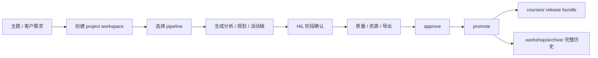

---

## 1. 谁在用它

Course Workshop 主要服务三类人。

### 1.0 角色与典型任务总览

| Persona | 典型触发 | 核心任务 | 最关心的问题 | 常走路径 |
|------|------|------|------|------|
| 课研主任 | 学期日历确定、月主题下发 | 形成完整月主题课程包或 PBL 预案 | 结构是否成立、周次递进是否顺、交付是否完整 | `insight -> planner -> activity/5step -> quality -> promote` |
| 一线教师 | 接到周安排或补某一节活动 | 快速补一节教学活动或某类活动稿 | 单稿是否可直接上课、话术是否具体 | `pipeline-select -> 5step / activity -> format` |
| 项目交付负责人 | 客户要求固定模板、需要导出 | 检查结构、整理导出包、准备客户版式交付 | 输出是否稳定、是否可追溯、是否好导出 | `format -> export-bundle -> approve -> promote` |

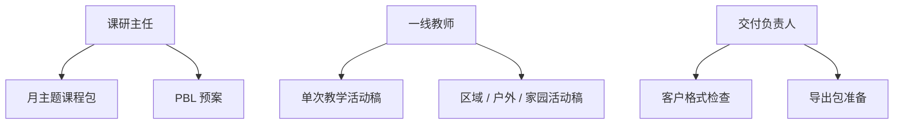

### 1.1 课研主任

她最常见的任务不是“写一节课”，而是：

- 接到一个月主题
- 判断这个主题值不值得做
- 把它拆成周次递进
- 安排不同类型的活动
- 审核教师稿件
- 最终交付给园所或客户

她最关心的是：

- 整体结构是否成立
- 月/周编排是否顺
- 是否能快速出一个完整课程包
- 是否能减少反复改稿

### 1.2 一线教师

她最常见的任务是：

- 接收月主题或周安排
- 补一节教学活动稿
- 或补区域活动、户外游戏、生活渗透、家园互动
- 根据实际班级情况微调

她最关心的是：

- 单份活动稿是否好用
- 教师话术和材料是否够具体
- 活动重点、难点、观察支持要点是否清楚

### 1.3 项目交付负责人 / 客户成功

她最常见的任务是：

- 把客户的教案格式要求翻译成平台能力
- 检查最终产物是否符合客户版式
- 准备导出包
- 组织归档和交付

她最关心的是：

- 输出结构能否稳定复用
- 客户特有栏目、编码、版式能否挂到平台里
- 交付包是否清楚，历史是否可追溯

---

## 2. 平台在解决什么问题

幼儿园课程研发常见的真实问题不是“不会写内容”，而是：

- 主题、周次、活动之间经常脱节
- 同一个主题的产物分散在不同 Word 文件里
- 老师改的是终稿，主任看不到过程
- 每个月都在重复找旧资料
- 审批靠经验，不靠结构化证据
- 客户要的是课程包，不是单份 Markdown

Course Workshop 的设计回答是：

1. 用 `.workshop/projects/` 管一个主题项目。
2. 用 `.workshop/plans/` 管全局学期 / 月 / 周规划。
3. 用 `pipeline` 决定当前产物该走哪条方法论管线。
4. 用 `HIL` 在大阶段处强制人工确认。
5. 用 `courses/` 只保存最终交付物。
6. 用 `.workshop/archive/` 保存完整历史，保证可回溯。

### 2.1 传统方式 vs 平台方式

| 问题 | 传统做法 | 平台做法 |
|------|------|------|
| 主题、周次、活动脱节 | 多个 Word 手工维护 | 用 project + plans + pipeline 串起来 |
| 返工代价高 | 改终稿，连锁返工 | 先在中间产物上过 HIL |
| 审批靠经验 | 口头反馈、微信群碎片化 | `status` + HIL + 质量结果结构化记录 |
| 导出混乱 | 过程稿和终稿混在一起 | `archive` 留过程，`courses` 留交付 |
| 客户格式特殊 | 每次重新改版式 | `format` / `export-bundle` 固化导出协议 |

---

## 3. 先理解三个核心对象

### 3.1 project workspace

一个 project workspace 对应一个具体课程主题，例如：

- `spring-flowers`
- `people-around-me`
- `clothing-and-seasons`

它不等于一节课，也不等于一个插件流程。

一个 project 里可以同时存在：

- `theme-analysis.md`
- `theme-narrative.md`
- `theme-network.md`
- `proposal.md`
- `lesson-plan.md`
- `resource-plan.md`
- `review-comments.md`

也就是说，**project 是容器，产物可以有多种。**

### 3.2 planning workspace

planning workspace 放在 `.workshop/plans/` 下，表示全局规划资产：

- 学期计划
- 月计划
- 周计划

它和 project 的关系是“引用”，不是复制。

例如：

- `2026-spring`
- `2026-april`
- `2026-april-week-2`

project 可以通过 `plan_refs` 关联它们。

### 3.3 pipeline

pipeline 决定这次产物要走哪条方法论路径。

当前核心 pipeline 包括：

- `pbl-huamei`
- `five-step`
- `thematic-curriculum`

注意：

- `pipeline` 不是 studio 里的脚手架模板
- `pipeline` 是课程运行时的方法论管线

### 3.4 三个对象的关系

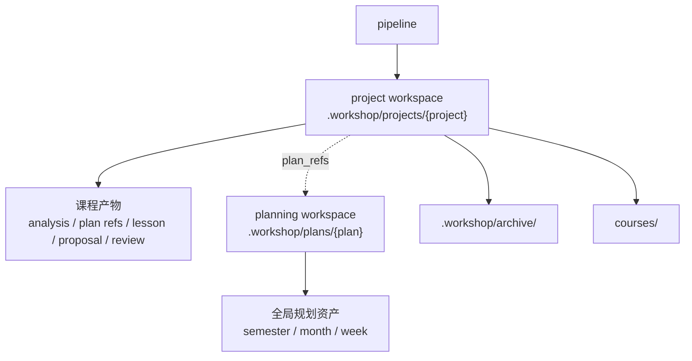

### 3.5 运行时目录关系

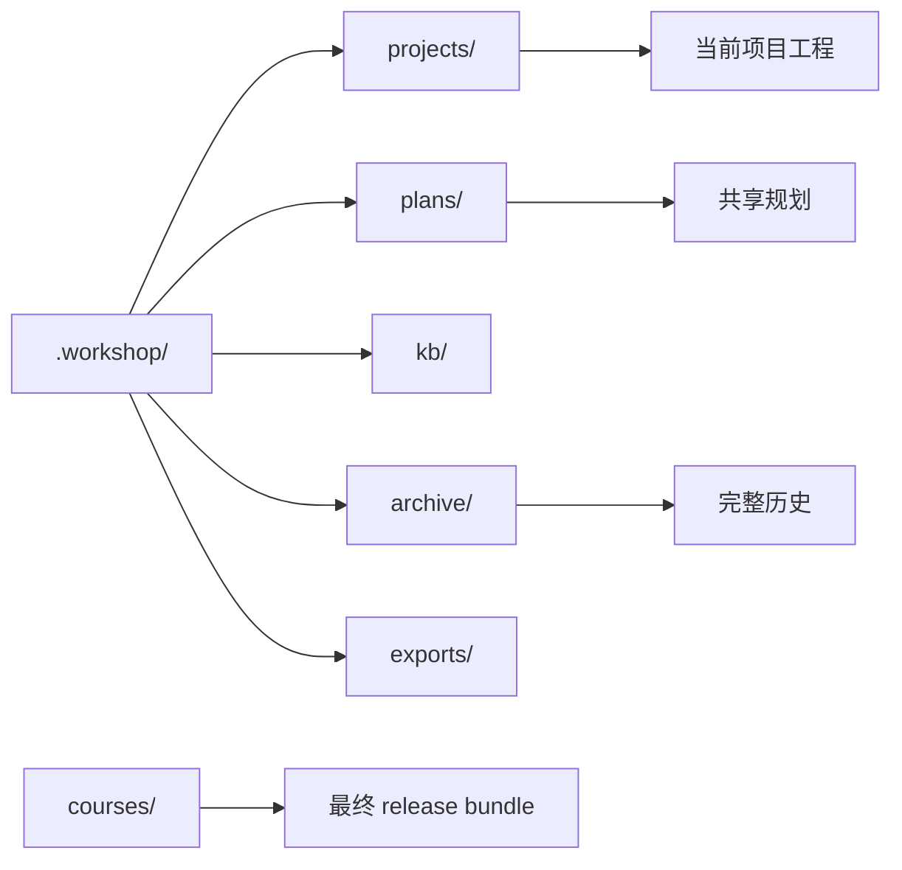

---

## 4. 用户从哪里开始

用户实际开始使用时，主路径通常是：

```text
init -> config -> onboarding -> 创建项目 -> 选择 pipeline -> 逐步产出 -> 审批 -> 发布
```

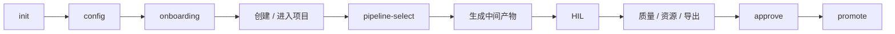

### 4.1 `init`：先把课程工作台跑起来

用户第一次进入仓库，第一步不是写主题，而是先执行：

```text
/workshop-core:init
```

这一步会创建运行时骨架：

```text
.workshop/
├── config.yaml
├── projects/
├── plans/
├── agents/custom/
├── kb/
├── archive/
└── exports/
```

这一步的意义不是“做课程”，而是把后续所有项目放到一个统一工作台里。

### 4.2 `config`：再看默认设置

然后用户会看或改配置：

```text
/workshop-core:config show
```

这里能看到：

- 默认 methodology / pipeline
- 模型配置
- 导出目录
- 发布目标
- experts 目录

如果客户有自己的默认交付风格，通常在这一步先调好基础参数。

### 4.3 `onboarding`：让系统知道你准备怎么开始

再执行：

```text
/workshop-core:onboarding
```

这一步不是写文件，而是帮助用户回答几个关键问题：

- 你是课研主任还是一线教师
- 你准备先做 planning 还是先做 project
- 你主要走 PBL、五步法，还是主题式课程
- 你是否已经有 KB 资料

系统据此推荐下一步，而不是把所有技能平铺给你。

### 4.4 三种最典型入口

| 用户当前状态 | 建议入口 | 为什么 |
|------|------|------|
| 手里只有月主题，还没想好方法论 | `onboarding -> pipeline-list` | 先定路线，不急着写稿 |
| 已有学期/月/周安排，需要继续展开 | `link-plan -> month-plan / week-plan` | 先把 planning 和 project 连接起来 |
| 只缺一节教学活动稿 | `pipeline-select five-step -> lesson-objective` | 不必重走整月流程 |

---

## 5. 核心场景一：客户主题式课程包如何走通

这是当前最贴近“教研工坊”客户交付的主场景。

### 5.1 场景定义

角色：

- 主导：课研主任
- 参与：一线教师、交付负责人

任务：

- 围绕一个月主题，交付完整主题课程包

目标交付物：

- 主题解读
- 主题网络图
- 月度活动矩阵
- 周活动安排
- 教学活动稿
- 区域活动稿
- 户外游戏稿
- 生活渗透稿
- 家园互动稿
- 最终导出包

### 5.1a 主题式课程包全链路图

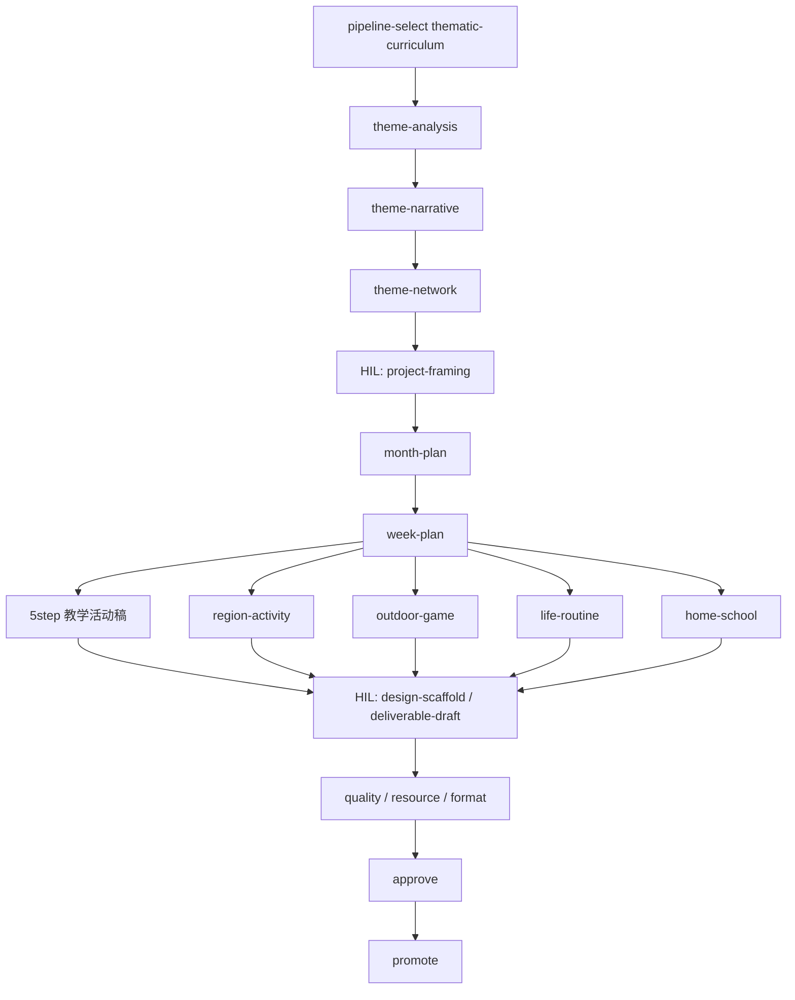

### 5.2 第一步：创建项目并选择主题式课程 pipeline

先创建主题项目，例如：

```text
/workshop-pipelines:pipeline-select thematic-curriculum
```

系统会在 `.workshop/projects/{workspace}/` 下创建最小项目骨架：

```text
.workshop/projects/clothing-and-seasons/
├── config.yaml
└── status.json
```

这里会写入：

- 当前 pipeline
- 目标交付物类型
- `status.json`
- 初始 HIL checkpoint：`project-framing`

### 5.3 第二步：做主题 framing

接下来不是马上写周计划，而是先做主题 framing：

```text
/workshop-insight:theme-analysis clothing-and-seasons
/workshop-insight:theme-narrative clothing-and-seasons
/workshop-insight:theme-network clothing-and-seasons
```

这三步分别解决不同问题：

- `theme-analysis`
  - 这个主题值不值得做
  - 和年龄段是否匹配
  - 五大领域能否展开

- `theme-narrative`
  - 把分析变成客户能看的“主题解读”
  - 讲清为什么做、怎么递进

- `theme-network`
  - 形成“核心主题 -> 子主题 -> 领域目标簇”的结构图
  - 为后续月矩阵和周编排提供骨架

此时项目目录会演化成：

```text
.workshop/projects/clothing-and-seasons/
├── config.yaml
├── status.json
├── theme-analysis.md
├── theme-narrative.md
└── theme-network.md
```

### 5.3a 这三个 framing 产物各自解决什么

| 产物 | 解决的问题 | 给谁看 | 后续被谁消费 |
|------|------|------|------|
| `theme-analysis.md` | 这个主题值不值得做 | 课研主任内部 | `theme-narrative`, `theme-network` |
| `theme-narrative.md` | 主题解读怎么对客户表达 | 客户 / 主任 | `month-plan` |
| `theme-network.md` | 四周递进和领域目标怎么搭起来 | 主任 / 设计者 | `month-plan`, `week-plan` |

### 5.4 第三个关键动作：过第一个 HIL

在真正进入月度编排前，系统不会默认直通。

此时需要过第一个 HIL：

- checkpoint: `project-framing`

它要确认的是：

- 主题本身是否成立
- 四周递进是否成立
- 是否真的按 thematic-curriculum 继续推进

这是平台的重要原则：**先把方向确认，再放大工作量。**

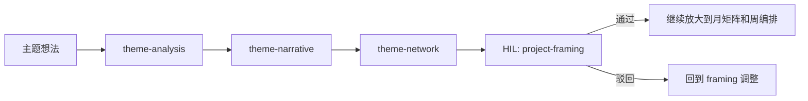

### 5.5 第三步：生成月矩阵和周编排

方向确定后，再进入 planner：

```text
/workshop-planner:month-plan clothing-and-seasons
/workshop-planner:week-plan clothing-and-seasons
```

这里的产物不只是“写几句规划说明”，而是开始贴近客户交付形态：

- `month-plan`
  - 生成月度主题活动矩阵
  - 定义周次递进
  - 预览材料和活动类型分布

- `week-plan`
  - 生成 15-17 项周活动编排
  - 混排教学活动、区域活动、户外游戏、生活渗透、家园互动
  - 输出教师备忘和材料提示

如果当前项目已经关联了某个 planning workspace，`plan_refs` 会把它们连起来。

### 5.5a 月矩阵和周编排的关系

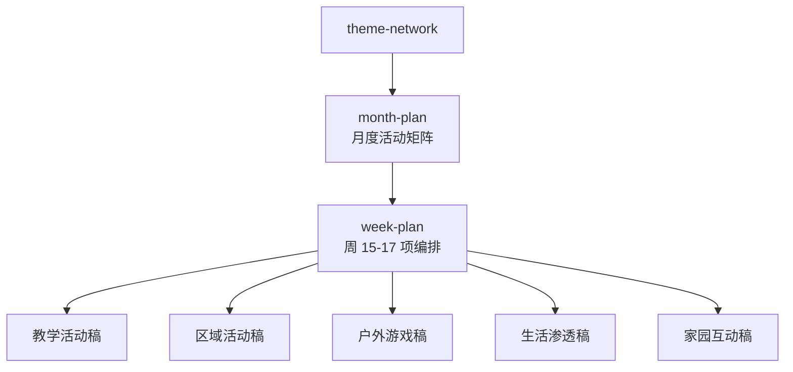

### 5.6 第四步：生成单活动稿

月和周的框架出来后，平台才进入具体活动稿层。

教学活动走：

```text
/workshop-5step:lesson-objective
/workshop-5step:lesson-scaffold
/workshop-5step:lesson-detail
/workshop-5step:lesson-generate
```

其他活动类型走：

```text
/workshop-activity:region-activity
/workshop-activity:outdoor-game
/workshop-activity:life-routine
/workshop-activity:home-school
```

这里体现了平台比传统“一个 Word 打天下”更强的地方：

- 不同活动类型有不同结构
- 但它们都回到同一个 project workspace
- 都能回写统一状态
- 都能被周编排引用

### 5.6a 五类活动稿的分工

| 活动类型 | 主要技能 | 解决什么问题 | 最适合谁补 |
|------|------|------|------|
| 教学活动 | `workshop-5step:*` | 需要完整目标、环节、话术和观察支持 | 一线教师 / 课研主任 |
| 区域活动 | `region-activity` | 需要材料投放和指导策略 | 一线教师 |
| 户外游戏 | `outdoor-game` | 需要玩法、安全和场地组织 | 教师 / 教研 |
| 生活渗透 | `life-routine` | 需要嵌入真实生活场景 | 班级教师 |
| 家园互动 | `home-school` | 需要家庭协作任务 | 班级教师 / 年级组 |

### 5.7 第五步：过设计骨架与草稿 HIL

在活动稿生成过程中，会进入两个重要 HIL：

- `design-scaffold`
  - 确认环节骨架、周结构和活动组织方式

- `deliverable-draft`
  - 确认活动稿已经达到可评审状态

这两个 checkpoint 的价值是：

- 把“方向错误”尽量挡在前面
- 避免老师把大量时间花在一个不成立的结构上

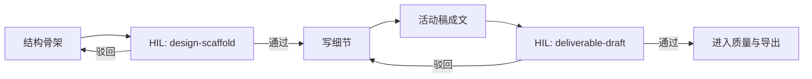

### 5.8 第六步：质量、资源与导出

生成完成后，可以继续走：

```text
/workshop-quality:standards-check
/workshop-resource:resource-planner
/workshop-format:format-lesson
/workshop-format:export-bundle
```

这里的逻辑是分层的：

- `quality`
  - 判断内容是否合理

- `resource`
  - 判断材料是否齐全

- `format`
  - 把语义产物整理成客户导出包
  - 不强制自己生成 docx/pdf
  - 为外部 harness 或渲染层准备稳定输入协议

### 5.9 第七步：审批和发布

最终通过：

```text
/workshop-core:approve
/workshop-core:promote
```

此时会发生两件事：

1. 完整工程进入：

```text
.workshop/archive/{date}-{workspace}/
```

2. 对外可交付内容进入：

```text
courses/{workspace}/
```

这就是平台里“工程”和“交付物”的正式分离：

- archive 留全过程
- courses 只放最终 release bundle

### 5.9a 最终交付的三层结构

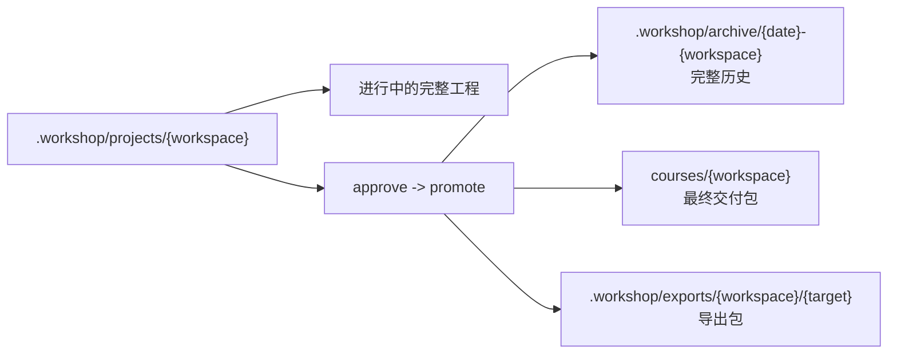

---

## 6. 核心场景二：PBL 预案如何工作

### 6.1 场景定义

角色：

- 主导：课研主任

任务：

- 从一个月主题出发，产出完整 PBL 预案

主路径是：

```text
theme-analysis
-> prior-knowledge
-> competency-mapping
-> driving-question
-> network-map
-> inquiry-scaffold
-> activity-design
-> proposal-generate
-> standards-check / proposal-review / resource-planner
-> approve
-> promote
```

```mermaid
flowchart LR
    A["theme-analysis"] --> B["prior-knowledge"]
    B --> C["competency-mapping"]
    C --> D["driving-question"]
    D --> E["network-map"]
    E --> F["inquiry-scaffold"]
    F --> G["activity-design"]
    G --> H["proposal-generate"]
    H --> I["quality / resource"]
    I --> J["approve"]
    J --> K["promote"]
```

### 6.2 它和主题式课程包的差别

PBL 不是按“5 种活动类型”组织，而是按“问题 -> 线索 -> 活动序列”组织。

所以它更适合：

- 探究性更强的主题
- 需要成果展示的月项目
- 课研团队内部方法论更统一的场景

它最终产出的是：

- `proposal.md`
- 相关活动线索文件
- 资源与评审结果

而不是客户那种月矩阵 + 周 17 项课程包。

### 6.3 为什么平台把它保留为单独流水线

因为 PBL 的设计逻辑和主题式课程包不一样：

- PBL 的核心是驱动问题和探究路径
- 主题式课程包的核心是月主题递进和多活动类型编排

两者不能简单混成一个“通用课程设计器”。

---

## 7. 核心场景三：一线教师如何快速补一节课

### 7.1 场景定义

角色：

- 主导：一线教师

任务：

- 在已有月主题或周安排下，快速完成一节教学活动稿

这时她不一定需要整个月规划，也不一定需要 PBL。

最常见路径是：

```text
/workshop-pipelines:pipeline-select five-step
/workshop-5step:lesson-objective
/workshop-5step:lesson-scaffold
/workshop-5step:lesson-detail
/workshop-5step:lesson-generate
```

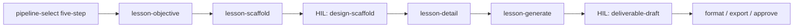

### 7.2 中间产物为什么要保留

平台不会只给一个最终 `lesson-plan.md`，还会经过：

- `lesson-objective.md`
- `lesson-scaffold.md`
- `lesson-detail.md`

原因不是为了“多文件”，而是为了把老师最容易卡住的地方拆开：

- 目标先对不对
- 环节顺不顺
- 话术够不够具体

这能明显降低“整份重写”的概率。

### 7.3 为什么还要 HIL

即便是一节课，也不是一生成就默认可交付。

关键节点仍然有：

- `design-scaffold`
- `deliverable-draft`

这保证：

- 教学结构先被看过
- 最终文稿再进入评审

---

## 8. 中间产物为什么这么多

很多人第一次看平台会问：

“为什么不直接给我最终文档？”

因为课程研发不是一次性文本生成问题，而是多阶段决策问题。

这些中间产物分别承担不同角色：

- `theme-analysis.md`
  - 证明主题有教育价值

- `theme-narrative.md`
  - 把分析翻译成客户语言

- `theme-network.md`
  - 把月主题结构化，支撑规划

- `month-plan.md`
  - 管月度矩阵

- `week-plan.md`
  - 管周安排

- `lesson-scaffold.md`
  - 管课堂结构

- `quality-report.md`
  - 管质量证据

- `resource-plan.md`
  - 管实施材料

这些文件的价值不是“多”，而是让后续每一步都有依据。

### 8.1 中间产物的作用分层

| 层级 | 典型文件 | 作用 |
|------|------|------|
| framing | `theme-analysis.md`, `theme-narrative.md`, `theme-network.md` | 决定主题是否成立、如何表达、如何展开 |
| planning | `month-plan.md`, `week-plan.md` | 决定活动如何在月和周层面组织 |
| design | `lesson-scaffold.md`, `lesson-detail.md`, `proposal.md` | 决定单次活动或完整方案如何实施 |
| governance | `quality-report.md`, `review-comments.md`, `resource-plan.md` | 决定是否能交付、资源是否齐全 |
| release | `courses/*`, `.workshop/exports/*` | 决定如何对外发布 |

---

## 9. 平台背后的三个关键原理

### 9.1 先结构，后内容

平台并不鼓励一上来就写终稿。

它先要求：

- 主题结构成立
- 周次递进成立
- 活动骨架成立

然后再写细节。

这是为了减少返工。

### 9.2 先工程，后交付

平台把“工程”和“交付”分开：

- `.workshop/projects/`
  - 当前工作现场

- `.workshop/archive/`
  - 完整历史

- `courses/`
  - 最终交付包

这是为了让研发过程可追溯，同时保证客户拿到的是干净交付物。

### 9.3 先人定方向，再让系统放大

这就是 HIL 的本质。

平台不是替人做所有决策，而是：

- 在关键口子停下来
- 让人确认方向
- 再把系统化能力放大出去

这比纯自动生成更稳，也比纯人工更快。

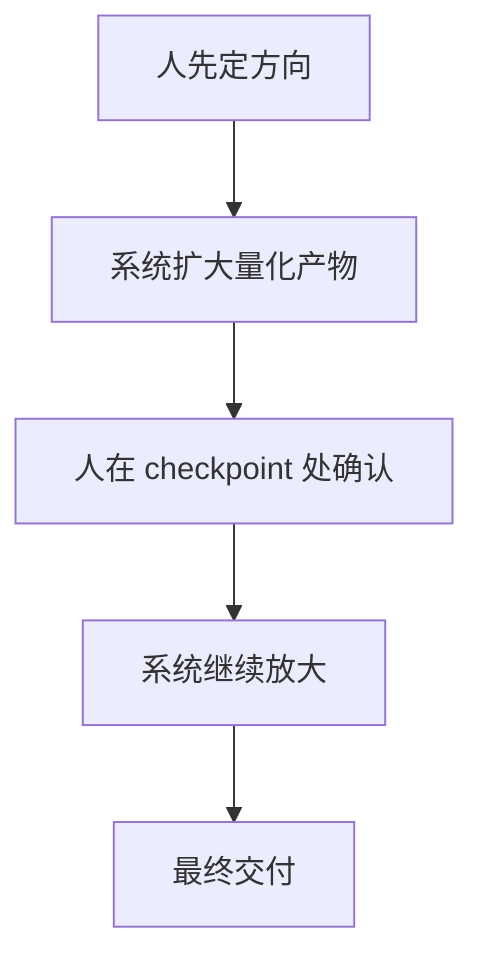

---

## 10. 一个最典型的完整操作顺序

如果今天一个客户要交付“中班第二个月主题课程包”，最典型的完整顺序是：

```text
1. /workshop-core:init
2. /workshop-core:config show
3. /workshop-core:onboarding
4. /workshop-pipelines:pipeline-select thematic-curriculum
5. /workshop-insight:theme-analysis 多样的服饰
6. /workshop-insight:theme-narrative 多样的服饰
7. /workshop-insight:theme-network 多样的服饰
8. HIL: project-framing
9. /workshop-planner:month-plan 多样的服饰
10. /workshop-planner:week-plan 多样的服饰
11. /workshop-5step:lesson-generate
12. /workshop-activity:region-activity
13. /workshop-activity:outdoor-game
14. /workshop-activity:life-routine
15. /workshop-activity:home-school
16. HIL: design-scaffold / deliverable-draft
17. /workshop-quality:standards-check
18. /workshop-resource:resource-planner
19. /workshop-format:format-lesson
20. /workshop-format:export-bundle
21. /workshop-core:approve
22. /workshop-core:promote
```

这条路径的意义是：

- 先把主题做对
- 再把月和周排顺
- 再把活动稿做细
- 最后才导出和交付

### 10.1 一页看懂完整主路径

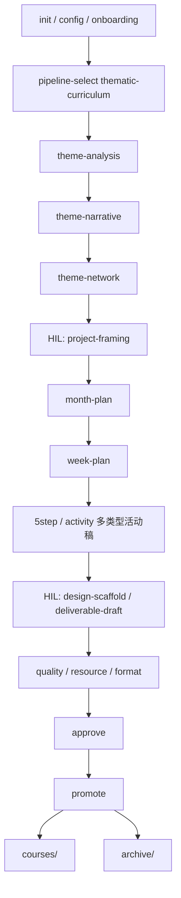

---

## 11. 对用户最重要的理解

如果只记住一句话，应该记住这个：

**Course Workshop 不是“帮你写一份文档”的工具，而是“帮你把课程项目从想法推进到可交付”的工作台。**

它最核心的价值不是多会写，而是：

- 把课程研发过程结构化
- 把关键决策前置
- 把多人协作放进同一个 project
- 把最终交付和完整历史分开

这也是它和“直接让模型生成一份教案”最大的区别。
